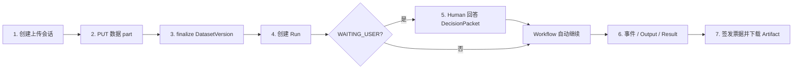

# Managed AutoML API 使用手册与示范案例

## 1. 文档目的

本手册面向 API 使用者、第三方 Agent 平台开发者和验收人员，说明如何从上传数据开始，
完成创建 AutoML 任务、处理人工中断、读取事件与结果、下载 artifact 的完整闭环。

当前 API/SDK 版本为 `0.8.0`。服务本身不调用 LLM；外部 Agent 平台负责 LLM 编排、
Prompt、DLP/脱敏、凭据保管和人机交互，API 负责可恢复的 AutoML 执行。

## 2. 当前服务入口

| 入口 | 场景 | 状态 |
| --- | --- | --- |
| `https://192.168.194.67:8443` | ZeroTier/内网入口 | 可用 |
| `https://192.168.77.32:8443` | `192.168.77.0/24` 内网入口 | 可用 |

两个入口使用同一内部 Caddy CA，但各自使用与 IP 匹配的证书。客户端必须安装或显式指定
该 CA，生产调用不得使用 `curl -k` 或 `verify=False`。

生产 Agent 平台不应等待部署方反复人工发放 JWT。推荐为每个合作方分配独立
`client_id/client_secret`，通过 OIDC token endpoint 自动获取和刷新 `AUTOML_TOKEN`，完整部署和
调用方法见[《OIDC/OAuth2 Client Credentials 接入手册》](oidc-client-credentials.md)。

调用本 API 时使用的环境变量：

```bash
export AUTOML_API_URL=https://192.168.77.32:8443
export AUTOML_CA_FILE=/secure/path/automl-root.crt
export AUTOML_TOKEN='<short-lived-agent-jwt>'
export AUTOML_HUMAN_TOKEN='<short-lived-human-jwt>'
```

`AUTOML_TOKEN` 是 OAuth token endpoint 返回的短期 access token，不是长期 API key；SDK 可在到期前
自动重取。`AUTOML_TOKEN` 和 `AUTOML_HUMAN_TOKEN` 必须属于同一 tenant，但 actor type 分别为
`agent` 和 `human`。不得将 token 或 client secret 放入 Git、Prompt、记忆、trace、issue 或命令行参数。

## 3. 使用前检查

### 3.1 健康检查

```bash
curl --cacert "$AUTOML_CA_FILE" -fsS "$AUTOML_API_URL/healthz"
```

预期：

```json
{"status":"ok"}
```

### 3.2 读取 Agent manifest

```bash
curl --cacert "$AUTOML_CA_FILE" -fsS \
  "$AUTOML_API_URL/v1/agent/manifest" \
  -H "Authorization: Bearer $AUTOML_TOKEN" | jq .
```

提交任务前必须检查：

- `service_version` 与 SDK 兼容。
- 目标后端的 `available=true`。
- 任务类型和数据媒体类型受支持。
- 数据大小、上传 part、预算和并发上限符合当前 manifest。
- `production_external_llm_safe=false` 依然是硬边界，Agent 平台必须自行完成 DLP。

## 4. 核心调用流程



客户端应持久化 `dataset_version_id`、`run_id`、`run_revision`、`wait_set_revision`、
`snapshot_seq`、`output_id` 和 `artifact_id`，不要从展示文本推断状态。

## 5. 案例一：使用 Python SDK 完成全流程

### 5.1 安装 SDK

从发布包安装：

```bash
python -m pip install wheels/automl_sdk-0.8.0-py3-none-any.whl
```

从源码仓库运行案例：

```bash
PYTHONPATH=packages/python_sdk/src \
python examples/python/sdk_guided_workflow.py \
  --base-url "$AUTOML_API_URL" \
  --ca "$AUTOML_CA_FILE" \
  --backend sklearn \
  --data examples/data/customer_churn.csv \
  --target churned
```

该案例会自动完成：

1. 读取 manifest 并检查 sklearn readiness。
2. 上传 CSV，校验 ETag 与 SHA-256。
3. 以 `GUIDED` 模式创建 Run。
4. 等待目标列和 i.i.d. 确认问题。
5. 使用 Human token 回答，并等待 workflow 继续。
6. 读取事件、结果和 outputs。
7. 下载所有 artifact，校验文件大小和 SHA-256。

示例输出：

```json
{
  "service_version": "0.8.0",
  "run_id": "run_000000000001",
  "backend_id": "sklearn",
  "outcome": "SUCCEEDED",
  "model_disposition": "NO_ELIGIBLE_MODEL",
  "event_count": 14,
  "last_event": "run.completed.v1",
  "artifacts": [
    {
      "artifact_id": "art_000000000001",
      "kind": "SPLIT_MANIFEST_JSON",
      "size_bytes": 6786,
      "sha256": "<sha256>"
    }
  ]
}
```

`NO_ELIGIBLE_MODEL` 表示 AutoML 离线流程成功，但没有产生通过生产审批的模型，不表示训练失败。

## 6. 案例二：使用原始 HTTP 完成全流程

已提供可直接运行的 HTTP 案例：

```bash
python examples/python/http_guided_workflow.py \
  --base-url "$AUTOML_API_URL" \
  --ca "$AUTOML_CA_FILE" \
  --backend sklearn \
  --data examples/data/customer_churn.csv \
  --target churned
```

以上脚本无需 SDK，使用 `httpx` 逐步调用 HTTP API，并自动处理响应中的资源 ID、上传 URL、
ETag、SHA-256、DecisionPacket 和 artifact 票据。以下 curl 用于展开关键 HTTP 步骤，其中
`<...>` 是必须替换的响应值或环境值，不能原样提交。

### 6.1 创建数据上传会话

```bash
curl --cacert "$AUTOML_CA_FILE" -fsS \
  -X POST "$AUTOML_API_URL/v1/datasets" \
  -H "Authorization: Bearer $AUTOML_TOKEN" \
  -H "Idempotency-Key: dataset-upload-0001" \
  -H 'Content-Type: application/json' \
  -d '{
    "name": "customer-churn-example",
    "filename": "customer_churn.csv",
    "media_type": "text/csv",
    "size_bytes": 1207
  }'
```

响应中需保存：

```json
{
  "dataset_id": "ds_000000000001",
  "dataset_version_id": "dsv_000000000001",
  "upload_id": "upl_000000000001",
  "parts": [
    {
      "part_number": 1,
      "url": "https://<same-origin>/v1/dataset-versions/.../upload-parts/1?...",
      "required_headers": {"<header-name>": "<header-value>"}
    }
  ]
}
```

`size_bytes` 必须是待上传文件的精确字节数。仓库当前示例文件为 `1207` 字节；其他文件可用
`wc -c < <file>` 计算。

### 6.2 上传 part

必须使用服务返回的 `parts[].url` 和 `required_headers`，不得自行拼接 URL。

```bash
curl --cacert "$AUTOML_CA_FILE" -fsS -D upload-headers.txt \
  -X PUT '<parts[0].url>' \
  -H 'Authorization: Bearer <agent-token>' \
  -H '<required-header-name>: <required-header-value>' \
  -H 'Content-Type: text/csv' \
  --data-binary @examples/data/customer_churn.csv
```

保存响应头中的 `ETag`，并计算本地 SHA-256：

```bash
shasum -a 256 examples/data/customer_churn.csv
```

Linux 可使用 `sha256sum`。

### 6.3 finalize DatasetVersion

```bash
curl --cacert "$AUTOML_CA_FILE" -fsS \
  -X POST "$AUTOML_API_URL/v1/dataset-versions/dsv_000000000001:finalize" \
  -H "Authorization: Bearer $AUTOML_TOKEN" \
  -H "Idempotency-Key: dataset-finalize-0001" \
  -H 'Content-Type: application/json' \
  -d '{
    "upload_id": "upl_000000000001",
    "parts": [{"part_number": 1, "etag": "<etag-from-put>"}],
    "sha256": "<local-file-sha256>"
  }'
```

预期返回 HTTP `202`，并得到状态为 `READY` 的 `DatasetVersion`。

### 6.4 创建 sklearn Run

```bash
curl --cacert "$AUTOML_CA_FILE" -fsS \
  -X POST "$AUTOML_API_URL/v1/runs" \
  -H "Authorization: Bearer $AUTOML_TOKEN" \
  -H "Idempotency-Key: sklearn-run-0001" \
  -H 'Content-Type: application/json' \
  --data-binary @examples/requests/sklearn-guided.json
```

提交前将 JSON 中的 `dsv_REPLACE_ME` 替换为真实 `dataset_version_id`。创建成功返回 HTTP
`202` 和 `run_id`。

需要阶段回调时，先调用 `POST /v1/webhook-endpoints` 注册 HTTPS URL 并保存仅返回一次的
`signing_secret`，再在 Run JSON 中增加：

```bash
curl --cacert "$AUTOML_CA_FILE" -fsS \
  -X POST "$AUTOML_API_URL/v1/webhook-endpoints" \
  -H "Authorization: Bearer $AUTOML_TOKEN" \
  -H "Idempotency-Key: webhook-create-0001" \
  -H 'Content-Type: application/json' \
  -d '{
    "url": "https://agent.example.com/automl/callback",
    "event_types": ["run.stage_completed.v1", "run.completed.v1", "run.failed.v1"]
  }'
```

```json
{
  "callback_uri": "https://agent.example.com/automl/callback",
  "webhook_endpoint_ids": ["wh_000000000001"]
}
```

URL 必须完全匹配同租户 ACTIVE endpoint。每完成 `INGEST/PROFILE/PLAN/TRAIN/EVALUATE/PACKAGE`
之一，服务在该阶段真实 durable barrier 之后投递 `run.stage_completed.v1`；失败自动重试，
接收方按 delivery ID 幂等。可运行的 raw-body HMAC 验签接收端见
[`examples/python/webhook_receiver.py`](../examples/python/webhook_receiver.py)。
签名信封的 `callback` 字段还会直接给出 `stage`、`states`、`next_stage` 和 `reason`；详见
[阶段 Callback 契约](stage-callback-contract.md)。

### 6.5 查询 Run

```bash
curl --cacert "$AUTOML_CA_FILE" -fsS \
  "$AUTOML_API_URL/v1/runs/<run_id>" \
  -H "Authorization: Bearer $AUTOML_TOKEN" | jq .
```

常见状态：

| 状态 | 含义 | 客户端动作 |
| --- | --- | --- |
| `QUEUED` | 等待 worker | 继续读取事件或轮询 |
| `RUNNING` | 执行中 | 保存 `snapshot_seq` |
| `WAITING_USER` | 需要人工确认 | 读取开放 DecisionPacket |
| `PAUSED` | 已暂停 | 根据 revision 继续或取消 |
| `TERMINAL` | 已结束 | 读取 RunResult |

### 6.6 读取并回答 DecisionPacket

```bash
curl --cacert "$AUTOML_CA_FILE" -fsS \
  "$AUTOML_API_URL/v1/runs/<run_id>/decision-packets?status=OPEN" \
  -H "Authorization: Bearer $AUTOML_TOKEN" | jq .
```

回答必须使用 Human token，并一次提交当前 wait-set 中所有必答问题：

```bash
curl --cacert "$AUTOML_CA_FILE" -fsS \
  -X POST \
  "$AUTOML_API_URL/v1/runs/<run_id>/decision-packets/<wait_set_id>:answer" \
  -H "Authorization: Bearer $AUTOML_HUMAN_TOKEN" \
  -H "Idempotency-Key: decision-answer-0001" \
  -H 'If-Match: "<wait_set_revision>"' \
  -H 'Content-Type: application/json' \
  -d '{
    "answers": [
      {"question_id": "q_target", "value": "churned"},
      {"question_id": "q_iid", "value": true}
    ]
  }'
```

返回 HTTP `202` 和 `command_id`。轮询命令：

```bash
curl --cacert "$AUTOML_CA_FILE" -fsS \
  "$AUTOML_API_URL/v1/commands/<command_id>" \
  -H "Authorization: Bearer $AUTOML_HUMAN_TOKEN" | jq .
```

Command 进入 `SUCCEEDED` 后 workflow 会自动继续，不需要额外调用 resume。如果返回
`412 stale_revision`，必须重新读取开放 packet，不得重放旧答案。

### 6.7 读取事件、outputs 和结果

```bash
curl --cacert "$AUTOML_CA_FILE" -fsS \
  "$AUTOML_API_URL/v1/runs/<run_id>/events?after_seq=0&limit=100" \
  -H "Authorization: Bearer $AUTOML_TOKEN" | jq .

curl --cacert "$AUTOML_CA_FILE" -fsS \
  "$AUTOML_API_URL/v1/runs/<run_id>/outputs?limit=100" \
  -H "Authorization: Bearer $AUTOML_TOKEN" | jq .

curl --cacert "$AUTOML_CA_FILE" -fsS \
  "$AUTOML_API_URL/v1/runs/<run_id>/result" \
  -H "Authorization: Bearer $AUTOML_TOKEN" | jq .
```

SSE 订阅：

```bash
curl --cacert "$AUTOML_CA_FILE" -N \
  "$AUTOML_API_URL/v1/runs/<run_id>/events" \
  -H "Authorization: Bearer $AUTOML_TOKEN" \
  -H 'Accept: text/event-stream' \
  -H 'Last-Event-ID: <last-seq>'
```

断线后使用 `Last-Event-ID` 或 `after_seq` 续读，并按 `event_id` 去重，不得因断线重新创建 Run。

`EVALUATION_REPORT.payload.visualizations[]` 给出评估图状态，成功图的 PNG 引用同时位于
`EVALUATION_REPORT.artifact_refs[]` 和 `RunResult.visualization_refs[]`。callback 只发送引用和
阶段摘要，不内嵌图片或逐行预测。

### 6.8 下载 artifact

先从 Output 的 `artifact_refs[]` 取得 `artifact_id`，然后签发短期票据：

```bash
curl --cacert "$AUTOML_CA_FILE" -fsS \
  -X POST "$AUTOML_API_URL/v1/artifacts/<artifact_id>:download" \
  -H "Authorization: Bearer $AUTOML_TOKEN" \
  -H "Idempotency-Key: artifact-download-0001" | jq .
```

必须使用响应中的 `url` 和 `required_headers` 下载，不得把 API Bearer 发送到跨域对象存储。
下载后校验：

- HTTP `ETag` 与票据一致。
- 文件大小与 `size_bytes` 一致。
- 文件 SHA-256 与票据 `sha256` 一致。
- 中断后可按 `Range` 续传。

## 7. 三种后端请求案例

### 7.1 sklearn 引导式二分类

```json
{
  "dataset_version_id": "dsv_REPLACE_ME",
  "objective": {
    "backend_id": "sklearn",
    "target_column": null,
    "task_type": "BINARY_CLASSIFICATION",
    "positive_class": 1,
    "iid_confirmed": null,
    "primary_metric": "roc_auc",
    "business_context": "synthetic guided example"
  },
  "autonomy": {"mode": "GUIDED", "production_deploy": "DISABLED"},
  "policy": {
    "allow_pii": false,
    "allow_external_llm": false,
    "risk_tier": "STANDARD"
  },
  "budget": {
    "max_trials": 2,
    "max_compute_credits": 1,
    "max_wall_time_seconds": 600,
    "max_llm_tokens": 0
  }
}
```

样例文件：`examples/requests/sklearn-guided.json`。

### 7.2 AutoGluon 二分类

```json
{
  "dataset_version_id": "dsv_REPLACE_ME",
  "objective": {
    "backend_id": "autogluon",
    "target_column": "churned",
    "task_type": "BINARY_CLASSIFICATION",
    "positive_class": 1,
    "iid_confirmed": true,
    "primary_metric": "roc_auc",
    "business_context": "synthetic AutoGluon example"
  },
  "autonomy": {"mode": "GUIDED", "production_deploy": "DISABLED"},
  "policy": {
    "allow_pii": false,
    "allow_external_llm": false,
    "risk_tier": "STANDARD"
  },
  "budget": {
    "max_trials": 1,
    "max_compute_credits": 1,
    "max_wall_time_seconds": 600,
    "max_llm_tokens": 0
  }
}
```

样例文件：`examples/requests/autogluon-binary.json`。AutoGluon 产物为 predictor `tar.gz`，只能从
可信 artifact store 加载。

### 7.3 TabPFN 回归

```json
{
  "dataset_version_id": "dsv_REPLACE_ME",
  "objective": {
    "backend_id": "tabpfn",
    "target_column": "target",
    "task_type": "REGRESSION",
    "iid_confirmed": true,
    "primary_metric": "rmse",
    "business_context": "synthetic TabPFN regression example"
  },
  "autonomy": {"mode": "GUIDED", "production_deploy": "DISABLED"},
  "policy": {
    "allow_pii": false,
    "allow_external_llm": false,
    "risk_tier": "STANDARD"
  },
  "budget": {
    "max_trials": 1,
    "max_compute_credits": 1,
    "max_wall_time_seconds": 1200,
    "max_llm_tokens": 0
  }
}
```

样例文件：`examples/requests/tabpfn-regression.json`，对应数据为 `examples/data/regression.csv`。
只有 manifest 中 `tabpfn.available=true` 时才能提交。对外展示结果时必须保留：

```text
Built with PriorLabs-TabPFN
```

## 8. 主要 API 路由速查

### 8.1 系统与契约

| 方法 | 路由 | 作用 |
| --- | --- | --- |
| `GET` | `/healthz` | 公网存活检查 |
| `GET` | `/readyz` | 内部 readiness，生产网关不对外暴露 |
| `GET` | `/openapi.yaml` | 完整 OpenAPI 契约 |
| `GET` | `/v1/agent/tool-openapi.yaml` | 供 Agent 平台注册工具的精简契约 |
| `GET` | `/v1/agent/manifest` | 版本、限制、后端和 Agent 能力 |
| `GET` | `/v1/runs/{run_id}/agent-context` | 读取受限的 Run context |
| `GET` | `/v1/runs/{run_id}/agent-actions` | 读取当前 Run 可用的 canonical actions |

### 8.2 Dataset 与上传

| 方法 | 路由 | 作用 |
| --- | --- | --- |
| `POST` | `/v1/datasets` | 创建 Dataset 和上传会话 |
| `PUT` | 服务返回的 upload URL | 上传数据 part |
| `POST` | `/v1/dataset-versions/{id}/upload-parts:sign` | 继续/增补 part 签名 |
| `POST` | `/v1/dataset-versions/{id}:finalize` | 校验 ETag/SHA-256 并完成上传 |
| `DELETE` | `/v1/datasets/{dataset_id}` | 启动数据集及派生资源删除 |
| `GET` | `/v1/deletions/{deletion_id}` | 跟踪删除任务 |

### 8.3 Run 与过程

| 方法 | 路由 | 作用 |
| --- | --- | --- |
| `POST` | `/v1/runs` | 创建 AutoML Run |
| `GET` | `/v1/runs` | 分页列出 Run |
| `GET` | `/v1/runs/{run_id}` | 读取权威快照 |
| `POST` | `/v1/runs/{run_id}:pause` | 暂停 Run |
| `POST` | `/v1/runs/{run_id}:resume` | 继续已暂停 Run |
| `POST` | `/v1/runs/{run_id}:cancel` | 取消 Run |
| `GET` | `/v1/runs/{run_id}/events` | JSON 补拉或 SSE 订阅 |
| `GET` | `/v1/runs/{run_id}/outputs` | 列出结构化输出 |
| `GET` | `/v1/runs/{run_id}/outputs/{output_id}` | 读取单个 Output |
| `GET` | `/v1/runs/{run_id}/result` | 读取终态 RunResult |

### 8.4 人工中断与 Command

| 方法 | 路由 | 作用 |
| --- | --- | --- |
| `GET` | `/v1/runs/{run_id}/decision-packets` | 列出人工问题 |
| `POST` | `/v1/runs/{run_id}/decision-packets/{wait_set_id}:answer` | Human 回答并继续 |
| `GET` | `/v1/commands/{command_id}` | 跟踪异步命令 |

### 8.5 Artifact、Webhook、审批和模型

| 方法 | 路由 | 作用 |
| --- | --- | --- |
| `GET` | `/v1/artifacts/{artifact_id}` | 读取 artifact 元数据 |
| `POST` | `/v1/artifacts/{artifact_id}:download` | 签发短期下载票据 |
| `GET` | 票据返回的 download URL | 下载 artifact bytes |
| `POST/GET` | `/v1/webhook-endpoints...` | 管理 callback、outbox、delivery 和重投 |
| `GET/POST` | `/v1/runs/{run_id}/approvals...` | 列出和决策审批 |
| `GET` | `/v1/models/{model_id}` | 读取通过门禁的模型候选 |

每个路由的完整请求头、Schema、状态码和 curl 说明见
[《API 路由使用手册》](api-route-reference.md)和 [`openapi/automl-api.yaml`](../openapi/automl-api.yaml)。

## 9. 幂等、并发和续传规则

- 所有 mutation 使用稳定的 `Idempotency-Key`。
- 同一 key 只能对应同一 operation 和同一 request body；不同请求复用 key 会返回 `409`。
- 回答 packet、pause、resume 等并发敏感操作必须带 `If-Match`。
- `412` 表示 revision 已过期，客户端必须重读资源后决策。
- `429/503` 只能根据 `Retry-After` 和 `retriable` 有界重试。
- SSE 使用 `Last-Event-ID`；artifact 使用 HTTP `Range`。

## 10. Agent 平台接入要求

Agent 平台应将 OpenAPI 中的 canonical operation 注册为受限工具，不提供通用
`execute_agent_action`。推荐处理循环：

1. 工具执行器从密钥存储取得短期 token，LLM 不能读取 token。
2. 调用 manifest，根据 readiness 和预算选择后端。
3. 上传前对数据、文件名、列名和业务说明执行 DLP。
4. 将 LLM 生成的参数按 JSON Schema、tenant、scope、资源 ID 和策略重新校验。
5. 持久化 Run 快照和最后事件 `seq`。
6. Run 进入 `WAITING_USER` 后停止自动化，展示完整 DecisionPacket。
7. 只允许同 tenant 的 Human token 提交答案。
8. API 结果进入 LLM 前再次执行字段 allowlist、PII 检测和长度限制。

列名、文件名、类别值、问题文本和报告摘要都是不可信数据派生内容。

## 11. 常见错误

| HTTP | 常见原因 | 处理方式 |
| --- | --- | --- |
| `400/422` | Schema、枚举、metric 或语义错误 | 修正请求，不自动重试 |
| `401` | token 缺失、过期或 issuer/audience 错误 | 刷新正确凭据 |
| `403` | operation scope、actor 或 policy 不允许 | 检查最小权限和角色 |
| `404` | 资源不存在或跨租户隐藏 | 检查 tenant 和资源 ID |
| `409` | 状态冲突或幂等键复用不同请求 | 重新读取权威状态 |
| `412` | revision 过期 | 重读 packet/Run 后提交 |
| `413` | 数据或请求体超限 | 按 manifest 限制调整 |
| `429` | 速率、存储或活跃 Run 超限 | 遵循 `Retry-After` |
| `500` | 内部错误 | 保存 correlation ID，联系运维 |
| `503` | 并发门禁、依赖或生产预检失败 | 查询健康状态和运维告警 |

向运维报告问题时只提供 correlation ID、operation、HTTP 状态、时间和脱敏后的 problem body，
不得提供 Bearer、下载票据、原始数据或模型访问凭据。

## 12. 完成验收标准

- 使用正确 CA 调用 `/healthz` 返回 HTTP `200`。
- manifest 返回期望的服务版本和后端 readiness。
- 数据上传 ETag、大小和 SHA-256 校验通过。
- Guided Run 进入 `WAITING_USER`，Human token 回答后自动继续。
- Run 进入 `TERMINAL`，结果、JSON 事件和 SSE 事件一致。
- artifact 的 ETag、大小和 SHA-256 全部一致。
- 通过两个 IP 入口创建上传会话时，返回 URL 保持对应 Origin。
- Agent 平台的 Prompt、trace 和日志中不存在 token、票据或未脱敏数据。

## 13. 相关资料

- [文档中心](README.md)
- [完整复现指南](reproduction-guide.md)
- [API 路由使用手册](api-route-reference.md)
- [外部 Agent 平台接入契约](external-agent-integration.md)
- [OIDC/OAuth2 Client Credentials 接入手册](oidc-client-credentials.md)
- [sklearn、AutoGluon 和 TabPFN 后端说明](framework-backends.md)
- [可运行案例目录](../examples/README.md)
- [Python SDK 说明](../packages/python_sdk/README.md)
