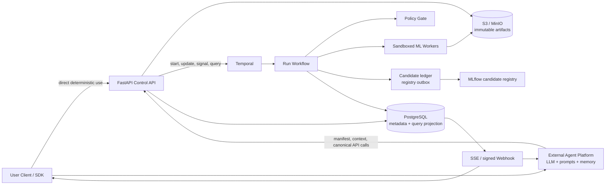
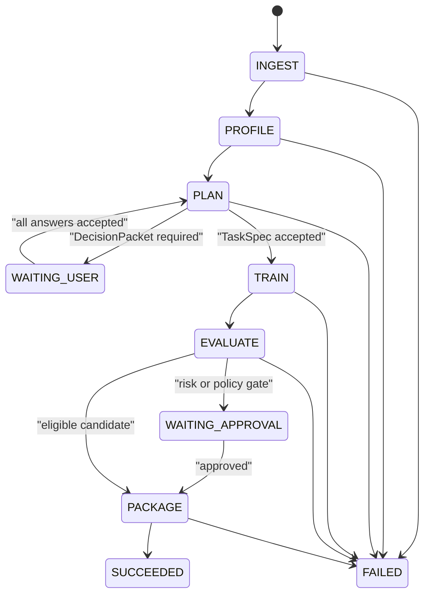
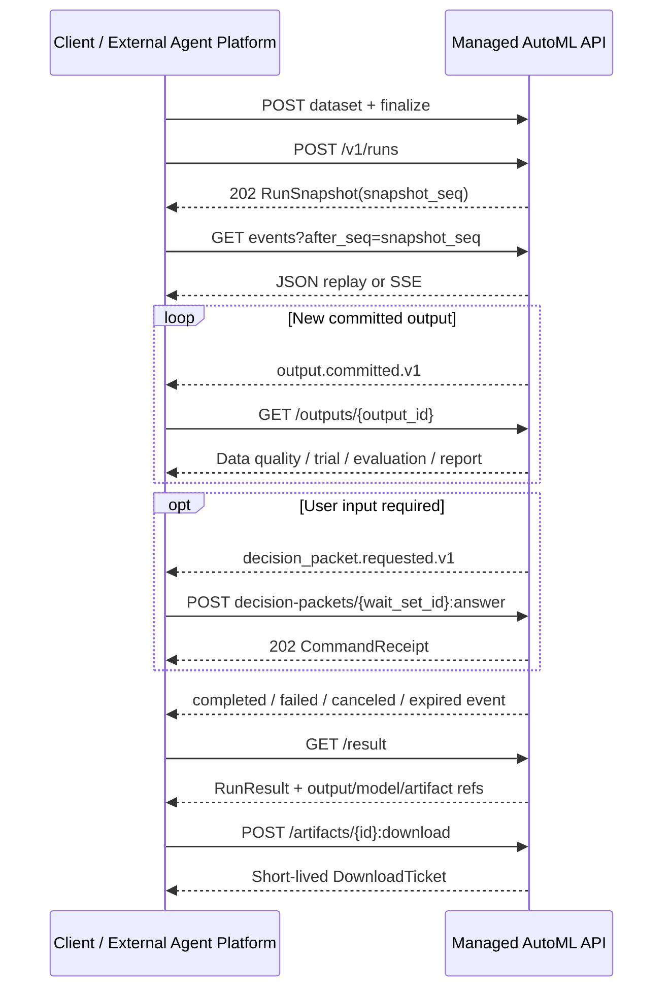

# 外部 Agent 驱动的 AutoML API 设计

- 状态：概念设计 v0.6（外部 Agent 边界修订）
- 日期：2026-07-23
- 目标：将数据、工作流、训练、状态和产物封装为独立 AutoML API；外部 Agent 平台提供 LLM 能力并调用该 API。遇到无法安全自动决定的事项时暂停，取得结构化回答后从持久化 checkpoint 继续。

## 1. 结论

这个产品不应被实现成“LLM 获得 Python 和云权限后自行训练模型”，也不应由 AutoML 服务内部固定任何 LLM 供应商，而应被实现成：

> **持久化 AutoML 服务负责状态、恢复和确定性 ML 工具；外部 Agent 平台负责 LLM 规划、解释与交互；所有状态写入都必须通过版本化 HTTP 契约和确定性策略门禁。**

使用者或 Agent 平台只面对版本化 HTTP API/SDK：上传数据、创建 Run、读取过程、回答问题和下载结果。Temporal、worker、MLflow、数据库和对象存储都是内部实现，不要求调用方感知或直接访问。AutoML 服务不保存 Prompt、思考过程或 LLM 凭据。

“只上传数据”是最低启动门槛，不是“系统永远不提问”的承诺。数据本身通常不能唯一决定目标列、预测时点、业务代价、敏感数据用途或生产发布权限。此类低置信度或高风险事项必须生成结构化 `DecisionPacket`，进入等待状态；用户提交答案后自动恢复。

MVP 只做：

- CSV/Parquet 单表数据；
- 二分类和回归；
- 数据剖析、任务推断、可靠切分、baseline、有界模型搜索、离线评估；
- 通过 API 持续返回阶段快照、事件、脱敏过程摘要和结构化输出；
- 终态通过 API 返回 `RunResult`，仅在质量门禁通过时注册 `eligible_candidate` 模型；
- 支持异步查询、事件流、暂停、回答后恢复、取消和故障恢复。

MVP 不做任意用户代码、任意模型生成、自动生产部署、在线学习、多表自动关联、时间序列和高影响领域无人审批。

## 2. 多 Agent 讨论后的关键取舍

| 议题 | 决定 | 原因 |
|---|---|---|
| LLM 位置 | 只存在于外部 Agent 平台，AutoML API 不调用 LLM | 保持执行后端独立，避免绑定模型供应商、Prompt 或 Agent 运行时 |
| 工作流 | 生产参考实现采用 Temporal | 人工等待、长任务、重试、取消和恢复是核心能力，不应重造微型工作流引擎 |
| 部署形态 | 同一代码库，至少拆成 API、workflow worker、ML worker 三类进程 | 避免多个 API 实例重复扫描、调度和发送事件 |
| 状态 | `phase`、`status`、`outcome` 正交建模 | 避免巨型状态枚举，同时用转换表禁止非法组合 |
| 人工介入 | 同一决策点的阻塞问题合并成一个版本化 `DecisionPacket` | 避免碎片化提问和并发回答导致的提前恢复 |
| 回答后行为 | `WAITING_USER` 在当前 wait-set 全部回答后自动恢复；主动 `PAUSED` 才显式恢复 | 区分系统等待输入与用户主动暂停 |
| 自动化门槛 | 置信度只能触发候选决策，不能绕过确定性规则或高风险审批 | LLM 的高置信不等于业务语义正确 |
| 发布 | MVP 仅注册通过质量门禁的 `eligible_candidate` | 先证明离线结论可信，再增加生产副作用 |
| Agent 接入顺序 | 先开放只读 context/action descriptor，再由平台调用现有 canonical 写端点 | 不新增通用 execute proxy，保留幂等、版本和授权语义 |
| 安全落地 | 最小授权、隔离、出站过滤和删除能力先于真实用户数据 | 安全不能被延后成生产硬化阶段的补丁 |

如果团队暂时无法运行 Temporal，可以用 PostgreSQL 状态机和 transactional outbox 构建本地概念验证；这不是推荐的生产实现。所有协议仍应以可迁移到 durable workflow 的方式定义。

## 3. 总体架构



### 3.1 控制面

- **Control API**：认证、租户权限、上传会话、创建/查询 Run、回答 `DecisionPacket`、暂停和取消。
- **Agent Integration API**：只读的 manifest、Run context 和 canonical action descriptor；不执行自由文本指令。
- **Temporal Workflow**：唯一的编排状态真相；维护阶段、预算、wait-set、重试、取消、checkpoint 和终态。
- **Policy Gate**：执行 JSON Schema 校验之外的语义、风险、预算、数据访问和部署规则。
- **PostgreSQL Projection**：面向 API 查询、审计和事件投递的投影，不代替 Temporal workflow history。

Temporal workflow 代码必须保持确定性。时钟之外的 I/O、数据读取和训练全部是 Activity；Activity 的返回值记录进 workflow history。外部 Agent 平台通过普通 HTTP 请求观察和更新资源，不进入 workflow 重放语义；重试仍由 `Idempotency-Key` 和资源 revision 约束。

每次语义状态变化由 workflow 先确定稳定的 `run_revision`、`seq` 和 `event_id`。`run_revision` 只随计划、阻塞集、审批、控制状态和终态等语义变化推进；高频 progress/trial 遥测可以产生新 `seq`，但不能推进控制 revision。投影以 `(run_id, seq)` 和 `event_id` 为唯一键，在一个 PostgreSQL 事务中写入 Run 投影候选、`run_event` 和 webhook outbox。乱序到达的较大 seq 先保持不可见；发布水位、`snapshot_seq`、JSON high-watermark 和 SSE live 边界只能推进到最大连续已提交 seq，缺口补齐后再按序发布。Activity 在数据库提交后丢失响应并重试时只能返回已有结果。Webhook dispatcher 可以重复发送，但使用稳定的 delivery ID，消费者按该 ID 去重。

### 3.2 数据面

- **Ingest/Profiler Worker**：文件校验、schema 推断、统计剖析、PII/敏感字段扫描。
- **Split Worker**：生成并冻结 `SplitManifest`，检查重复、实体和时间泄漏。
- **Training Worker**：只接受白名单模型和声明式 `ExperimentSpec`，不接受任意 Python。
- **Evaluation Worker**：计算主指标、护栏指标、区间、校准、错误切片和 baseline 差值。
- **Packaging Worker**：生成安全模型包、输入输出签名、模型卡和 lineage。

生产 worker 使用非 root 隔离容器或 gVisor，默认无出站网络、只读镜像、临时文件系统，并设置 CPU/GPU、内存、磁盘和 wall-clock 上限。长训练 Activity 创建可重连的 job，定期 heartbeat；Activity 重试时先 reconcile 现有 job，不能直接重复创建。

模型包先以内容寻址 artifact 写入对象存储。随后由候选注册 ledger 生成稳定的 `candidate_id`，通过 registry outbox 写入 MLflow；注册 Activity 重试时先按 `candidate_id` tag 查询并 reconcile，API 只暴露一个逻辑候选，不能把 MLflow 物理版本号当幂等键。

## 4. 状态与恢复语义

Run 使用三组字段：

```text
phase   = INGEST | PROFILE | PLAN | TRAIN | EVALUATE | PACKAGE
status  = QUEUED | RUNNING | WAITING_USER | WAITING_APPROVAL |
          PAUSE_REQUESTED | PAUSED | RETRYING | CANCEL_REQUESTED | TERMINAL
outcome = null | SUCCEEDED | FAILED | CANCELED | EXPIRED
```



关键 status 转换必须由一张版本化转换表实现并做穷举测试：

| 当前状态 | 事件 | 下一状态 |
|---|---|---|
| `RUNNING` | 主动暂停 | `PAUSE_REQUESTED` |
| `PAUSE_REQUESTED` | job 已终止/checkpoint | `PAUSED` |
| `WAITING_USER` | 当前 wait-set 全部回答 | 原 phase 的 `RUNNING` |
| `WAITING_USER` | durable timer 超时 | `PAUSED(INPUT_TIMEOUT)` |
| `WAITING_APPROVAL` | approve | 原 phase 的 `RUNNING` |
| `WAITING_APPROVAL` | request changes | `PLAN/RUNNING`，plan version 加一 |
| `WAITING_APPROVAL` | reject | 保留只读产物后 `TERMINAL/CANCELED` |
| 任意非终态 | cancel | `CANCEL_REQUESTED`，job 确认后 `TERMINAL/CANCELED` |

核心不变量：

1. `status=TERMINAL` 时 `outcome` 必须非空，终态不可逆。
2. `CANCEL_REQUESTED` 之后不得调度新任务；正在运行的 job 接收取消并在边界 checkpoint。
3. 一个 `(run_id, plan_version, wait_set_id)` 最多有一个开放 `DecisionPacket`。
4. 仅当当前 `wait_set_id` 的全部阻塞答案在同一 `run_revision` 下原子接受，workflow 才能恢复。
5. 主动暂停先进入 `PAUSE_REQUESTED`：停止新调度，取消或 checkpoint 当前 job；只有收到 job 终止/保存确认后才进入 `PAUSED`。不支持 checkpoint 的任务从最近任务边界恢复。
6. `WAITING_USER` 期间释放计算资源；超时关闭当前 wait-set 并进入带 `pause_reason=INPUT_TIMEOUT` 的 `PAUSED`，高风险问题不得使用静默默认值。恢复时创建新 revision 并重新打开或重新规划，旧 packet 永久失效。
7. 每个逻辑任务的幂等键是 `(run_id, plan_version, step_id, spec_hash)`；重复 Activity 可以运行，但只接受一个有效 attempt 的逻辑结果。
8. Artifact 不可变，必须记录 SHA-256、生成任务、数据版本、代码/镜像版本和父 artifact。

回答、审批、暂停和恢复使用 Temporal Workflow Update。REST `Idempotency-Key` 映射为 Temporal Update ID。回答的 `If-Match` 只校验 `DecisionPacket.wait_set_revision`，审批只校验 `Approval.evidence_version`，暂停/恢复才校验 Run 控制 `run_revision`；不相关的进度、trial 或语义更新不能使开放 wait-set 的回答冲突。相同更新重试返回原结果，目标资源版本过期返回 `412 stale_revision`。取消是无需 `If-Match` 的单调幂等紧急命令：非终态 Run 必须接受取消，已在取消时返回原命令，已终态时返回 `409`。

## 5. 托管 ML 生命周期

### 5.1 数据入库与剖析

1. 客户端获取预签名 multipart upload。
2. 完成上传时提交文件大小和 SHA-256；服务端校验实际对象。
3. 原始数据版本只读，清洗或类型修正必须生成新 `dataset_version_id`。
4. 切分前只生成 `PreSplitProfile`：解析状态、schema、行数、PII/安全结果、列角色线索和不含目标/特征分布的结构信息。跨行重复只输出 fingerprint 冲突，不暴露 holdout 统计。
5. `SplitManifest` 冻结后，另行从训练分区生成 `TrainDataProfile`：缺失、基数、分布、类别不平衡和建模统计。后端的确定性搜索只能读取训练画像；外部 Agent 平台若被授权读取相关输出，也不能取得 holdout 或原始记录。
6. 文件名、列名和单元格都按不可信数据处理；原始记录默认不发给外部 LLM。

恶意/损坏文件、目标全空或不可解析直接失败；PII、授权不明、关键 schema 冲突进入人工决策。

### 5.2 TaskSpec 推断

AutoML 后端由确定性规则生成候选 `TaskHypothesis[]` 和需要确认的 `DecisionPacket`。外部 Agent 可以在平台内部解释候选并建议回答，但只能经 canonical answer 请求影响状态，不能直接写入 workflow 或绕过门禁。最终 `TaskSpec` 至少包含：

```json
{
  "task_type": "binary_classification",
  "target_column_id": "col_17",
  "positive_class": "yes",
  "feature_allowlist": null,
  "feature_denylist": ["col_1"],
  "time_column_id": null,
  "group_column_ids": [],
  "prediction_time": null,
  "feature_availability_cutoff": null,
  "independence_evidence": [],
  "primary_metric": "average_precision",
  "guardrail_metrics": ["log_loss", "brier_score"],
  "split_strategy": "stratified_holdout",
  "risk_tier": "standard"
}
```

后端自动采用必须满足确定性证据、无语义冲突、无高风险门禁，并达到经过金标数据集校准的阈值。外部平台可以把模型置信度作为是否建议回答的依据，但该置信度不能绕过 API 的 Schema、版本、权限或策略校验。初始可测试策略是 top-1 置信度不低于 `0.85`、与 top-2 差值不低于 `0.20`；这些不是普适真理，必须按领域和真实错误率校准。

以下情况必须进入 `DecisionPacket`：

- target、任务类型、正类、预测时点或 horizon 不唯一；
- 时间列和实体列冲突，无法选择可靠 split；
- 缺少 i.i.d. 独立性证据或无法确定特征在预测时点是否可用；
- primary metric 与错判代价不清；
- 疑似后验字段、授权/PII 或数据处理会改变业务语义；
- 预算需要增加、模型族超出白名单或有生产副作用；
- 医疗、信贷、就业、教育等高影响用途。

### 5.3 Split 与泄漏门禁

- i.i.d. 数据才允许分层随机切分；重复实体使用 Group Split；有业务时间使用 time split/forward chaining。
- 在切分前检查精确和近重复；禁止同一实体、事件或后验记录跨 split。
- 所有预处理只在训练 fold 内拟合。
- `SplitManifest` 冻结 row ID、fold、seed、算法版本和数据 hash。
- TaskSpec 必须保存 `independence_evidence` 和 `feature_availability_cutoff`；证据缺失时不能静默退化为随机切分。
- 搜索阶段不得访问封存测试集；最终评估只打开一次。
- 仅修改 holdout 值时，最终评估前的 `RunPlan`、训练画像和搜索 artifact 必须保持完全不变。
- 简单模型出现 AUC `>0.995` 或 R2 `>0.98` 只能触发泄漏警报，不能单独证明泄漏。

### 5.4 Baseline、搜索与停止

每个 Run 必须先完成：

1. 朴素 baseline：多数类、均值等；
2. 简单可解释 baseline：逻辑/线性模型或浅树；
3. 只有 baseline 通过数据与 split 门禁后才允许有界搜索。

MVP 可使用 `scikit-learn + Optuna`，模型族和预处理均由注册表白名单控制。搜索计划必须携带 trials、wall-clock、CPU/GPU、内存、成本、推理延迟和许可证约束。

进入 `TRAIN` 前先运行成本预估 Activity，根据样本规模、fold、模型族、trial 和历史 telemetry 给出成本/时长区间。若上界超过剩余硬预算，Policy Gate 必须缩小计划或创建 `BUDGET_EXTENSION` DecisionPacket，不能先消耗资源再因预算失败。

停止条件包括预算耗尽、连续若干 trial 无有意义提升、候选未超过业务最小改进、策略/泄漏门禁失败。具体阈值属于版本化策略，不应硬编码成跨任务的固定真理。

### 5.5 评估与 eligible candidate 注册

搜索仅在训练分区的 CV 上进行。打开封存 holdout 前必须冻结模型、预处理、校准和决策阈值；最终比较在相同样本上对 candidate 与 baseline 做 paired bootstrap，报告指标差值的区间。小数据场景使用 nested CV，不能把调参 CV 的普通边际区间当作最终不确定性。

`EvaluationReport` 至少包含：

- 主指标、护栏指标、fold 分布和 95% bootstrap/CV 区间；
- 分类的 AUROC、PR-AUC、log loss/Brier、校准和阈值曲线；
- 回归的 MAE、RMSE、残差/预测区间；
- 子群指标、错误切片、鲁棒性告警；
- 相对 baseline 的提升及训练/推理成本；
- 已知限制、未验证假设和不适用场景。

candidate 相对 baseline 的配对提升下置信界未超过预先登记的业务最小提升、关键子群恶化、样本不足、业务阈值不明或高风险公平权衡未批准时，不得自动给出“可生产使用”的结论。

每次运行都可以生成 `evaluated_artifact`，但只有配对提升、护栏、风险和复现门禁全部通过时才生成 `eligible_candidate` 并进入注册 ledger。`ModelPackage` 包含模型和预处理、输入输出签名、数据/split/code/container lineage、依赖锁、随机种子、指标区间、模型卡和回滚信息。优先使用 ONNX 或 `skops` 等受控格式，不对外提供未经审计的可执行 pickle。

## 6. 外部 Agent、工具与策略契约

### 6.1 Agent 输入边界

AutoML API 通过三个只读接口支持外部 Agent 平台：

- `GET /v1/agent/manifest`：声明服务角色、OpenAPI、任务类型、默认执行后端、各后端运行时可用性和安全边界；
- `GET /v1/runs/{run_id}/agent-context`：返回 RunSnapshot、已确认 objective、开放 DecisionPacket、最近输出引用和事件水位；
- `GET /v1/runs/{run_id}/agent-actions`：返回当前允许的 canonical 写操作及其 `If-Match`/Schema 前置条件。

Run 必须显式设置 `policy.allow_external_llm=true` 才可读取 Agent context。响应固定声明 `contains_raw_dataset_rows=false`，但 objective、类别选项、列名、文件名、业务描述和问题文本仍可能包含不可信的数据派生值，因此同时声明 `may_include_dataset_derived_values=true` 和 `dataset_derived_text_trust=UNTRUSTED`。生产平台在把 context 传给 LLM 前必须做 DLP、字段 allowlist 和 opaque ID 转换；这些数据只能放在受限 data/tool-result 通道，不能拼接到 system/developer 指令中。

Run 通过 `objective.backend_id` 选择执行框架；省略时使用 manifest 的 `default_backend_id`。
平台在提交前必须检查 `backends[]` 中对应 descriptor 的 `available`、任务/媒体 capability 与 artifact
格式。`available` 只表示当前安装可执行，不代表模型具备生产资格。

AutoML token、对象存储票据、生产凭据和云权限只能由 Agent 平台的 tool executor 保管，不得进入 Prompt、记忆或 LLM trace。

### 6.2 Agent 输出和写入

Planner 输出是外部 Agent 平台的内部数据，不是 AutoML API 公共 Schema。平台必须把模型输出转换为已有的版本化请求：

- 回答问题调用 `answerDecisionPacket`，并使用 `WAIT_SET_REVISION`；
- 暂停或恢复调用 `pauseRun` / `resumeRun`，并使用 `RUN_REVISION`；
- 取消调用无 revision 但单调幂等的 `cancelRun`；
- 上传、创建 Run、读取输出和下载 artifact 继续调用 canonical OpenAPI 操作。

平台必须在调用前验证结构化输出 Schema、当前 action descriptor、资源 scope、策略和预算。API 不提供通用 `execute_agent_action`、自由文本命令或内部 tool proxy，因为这些入口会绕过幂等、并发和授权语义。

`RunBudget.max_llm_tokens` 仅为 v1 请求兼容而保留，AutoML 后端不消费它并始终报告 `llm_tokens.used=0`。LLM token、费用和调用次数预算属于外部 Agent 平台；manifest 通过 `llm_budget_owner=EXTERNAL_AGENT_PLATFORM` 和 `max_llm_tokens_consumed=false` 暴露这一事实。

### 6.3 内部白名单工具

MVP 只需要以下版本化工具：

- `profile_dataset.v1`
- `build_split_manifest.v1`
- `estimate_plan_cost.v1`
- `run_baselines.v1`
- `run_model_search.v1`
- `evaluate_candidate.v1`
- `package_candidate.v1`
- `render_run_report.v1`

这些工具是 workflow/worker 内部模块，不向外部 Agent 暴露直接调用权。工具输入是声明式 spec 和 artifact 引用，输出是不可变 artifact 引用和结构化结果。Policy Gate 必须同时做：

1. JSON Schema 校验；
2. 语义校验，例如 ID 列不能作为普通连续特征；
3. 当前 phase 和前置 artifact 校验；
4. 数据/租户 capability 校验；
5. 预算、许可证和风险策略校验。

新增模型、预处理器、指标或工具必须经过版本化扩展流程：提案与威胁分析、输入输出 Schema、资源/成本模型、许可证检查、隔离镜像、安全与黄金数据测试、策略规则、shadow 运行和显式放量。工具版本不可原地改变语义；旧 Run 必须能继续解析原版本。

## 7. DecisionPacket：中断与继续的核心

同一决策点的所有阻塞问题合并为一个 packet：

```json
{
  "decision_packet_id": "dp_01",
  "wait_set_id": "ws_01",
  "run_revision": 12,
  "kind": "CLARIFICATION",
  "reason": "task_spec_ambiguous",
  "blocking": true,
  "questions": [
    {
      "question_id": "q_target",
      "prompt": "哪一列是希望预测的结果？",
      "evidence": "系统识别出两个可能目标列：churned 与 status。",
      "answer_schema": {"type": "string", "enum": ["churned", "status"]},
      "recommendation": "churned",
      "recommendation_reason": "该列取值稳定且不像流程状态字段。",
      "consequences": {
        "churned": "训练流失预测模型",
        "status": "训练当前状态分类模型"
      }
    }
  ],
  "expires_at": "2026-07-29T08:00:00Z"
}
```

规则：

- 外部平台可以改善面向用户的措辞和解释，但不得改变 question ID、answer schema 或语义；是否阻塞由后端确定性规则决定。
- 同一 `question_fingerprint` 不得重复提问。
- 低风险、可回滚的选择可以使用租户预授权默认值，并作为非阻塞事件通知。
- 正常低风险黄金路径的目标是 P95 阻塞轮次不超过 1，而不是为追求零提问牺牲正确性。
- 回答只对指定 wait-set 和 `wait_set_revision` 有效；旧 packet 不能修改新计划，Run 的不相关更新也不能让当前 packet 的 ETag 失效。

### 7.1 审批与超时闭环

`DecisionPacket.kind` 至少支持 `CLARIFICATION | DATA_REMEDIATION | BUDGET_EXTENSION`。高风险、PII 用途或外部副作用使用独立 `Approval` 对象，由具备 `risk_approver` 权限的主体决定：

- `APPROVE`：满足 Policy Gate 后继续；
- `REQUEST_CHANGES`：回到 `PLAN` 并产生新 plan/revision；
- `REJECT`：按审批策略终止相关副作用，Run 仍可保留只读评估产物或进入 `CANCELED`。

审批超时关闭旧审批并进入 `PAUSED`。恢复操作只能创建新 revision 并重新发起审批，不能复活旧 approval。状态遍历测试必须证明每个非终态都存在完成、拒绝、取消或恢复路径。

## 8. API 契约

公共契约以 [OpenAPI 3.1 文件](../openapi/automl-api.yaml) 为准。使用者不读取内部数据库、Temporal history、worker 日志或 MLflow；所有可见过程和结果都先转换成稳定的 API 资源。



### 8.1 四层对外读取模型

| 资源 | 用途 | 更新语义 |
|---|---|---|
| `RunSnapshot` | 当前 phase/status、进度、预算、阻塞项和最新输出 | 可变快照，带 `run_revision`、ETag 和 `snapshot_seq` |
| `RunEvent` | 阶段变化、实验更新、问题、输出提交和终态 | 追加式、Run 内 `seq` 单调、至少一次投递 |
| `OutputResource` | 数据质量、TaskSpec、split、baseline、trial、评估、报告等 | 已提交后不可变；新版本用 `supersedes` 替代旧版本 |
| `RunResult` | 成功、失败、取消或无合格模型的最终清单 | 与终态和 ResultManifest 在同一逻辑提交边界原子可见 |

原始 worker 日志不属于公共 API。用户可见过程信息使用脱敏的 `LOG_SUMMARY` 输出：稳定原因码、摘要、次数和时间窗，不包含样本、Prompt、列值、内部栈或凭据。

### 8.2 核心端点

| 类别 | 端点 | 返回内容 |
|---|---|---|
| 上传 | `POST /v1/datasets` | dataset/version ID 和 multipart 上传会话 |
| 上传 | `POST /v1/dataset-versions/{id}:finalize` | `202 DatasetVersion`，异步校验 checksum/文件安全 |
| 启动 | `POST /v1/runs` | `202 RunSnapshot` |
| 快照 | `GET /v1/runs/{id}` | 当前状态、进度、阻塞项、预算和 `snapshot_seq` |
| 阶段 | `GET /v1/runs/{id}/stages` | 每个阶段的状态、进度和最新输出引用 |
| 事件 | `GET /v1/runs/{id}/events` | `application/json` 游标回放或 `text/event-stream` SSE |
| 输出 | `GET /v1/runs/{id}/outputs` | 按 type/phase/state 过滤的稳定分页输出 |
| 实验 | `GET /v1/runs/{id}/experiments` | baseline、trial、指标、配置摘要和成本 |
| 交互 | `GET /v1/runs/{id}/decision-packets` | 当前与历史问题 |
| 交互 | `POST /v1/runs/{id}/decision-packets/{wait_set_id}:answer` | `202 CommandReceipt`，回答后自动恢复 |
| 审批 | `POST /v1/runs/{id}/approvals/{approval_id}:decide` | 批准、拒绝或要求修改 |
| 控制 | `POST /v1/runs/{id}:pause|resume|cancel` | `202 CommandReceipt`；通过 `/v1/commands/{id}` 跟踪 |
| 终态 | `GET /v1/runs/{id}/result` | `RunResult`，包括部分结果或无模型原因 |
| Artifact | `GET /v1/artifacts/{id}` | 稳定元数据、大小、媒体类型、ETag、SHA-256 |
| 下载 | `POST /v1/artifacts/{id}:download` | 重新鉴权后签发短期 `DownloadTicket` |
| 模型 | `GET /v1/models/{id}` | eligible candidate、输入输出签名、限制和模型包引用 |
| 通知 | `/v1/webhook-endpoints` | Webhook 注册、密钥轮换、投递查询、失败重投和删除 |

大文件不通过控制面转发。API 始终返回稳定 `artifact_id`；客户端下载前再次调用 API 获取固定 900 秒、opaque 下载票据。票据支持 Range/ETag/Content-Length，且不暴露 bucket/key；撤权、删除或跨租户访问会立即失效。每个 HTTP 请求开始时鉴权，已建立的响应可以完成；票据过期后使用新 `Idempotency-Key` 换票，并按稳定 ETag 发起 Range 续传，不能复用旧幂等键取得旧票据。

### 8.3 中间输出

`OutputResource.type` 至少包括：

- `DATA_QUALITY_REPORT`：质量问题、门禁、影响和修复建议；
- `TASK_SPEC`：目标、任务、指标、预测时点、假设和确认来源；
- `SPLIT_MANIFEST`：切分策略、分区计数和泄漏检查；逐行映射放受控 artifact；
- `BASELINE_RESULT`：朴素/简单 baseline、指标与成本；
- `COST_ESTIMATE`：训练前成本/时长区间和假设；
- `TRIAL_RESULT`：抽象模型族、规范化配置、CV 指标、状态和成本；
- `EVALUATION_REPORT`：配对提升区间、护栏、限制和候选门禁；
- `LOG_SUMMARY`：脱敏过程摘要；
- `MODEL_CARD`、`RUN_REPORT`、`FAILURE_REPORT`。

```json
{
  "output_id": "out_42",
  "type": "TRIAL_RESULT",
  "schema_version": "1.0",
  "run_id": "run_01",
  "run_revision": 12,
  "created_seq": 31,
  "phase": "TRAIN",
  "state": "FINAL",
  "summary": {"code": "TRIAL_SUCCEEDED", "message": "当前排名第 1"},
  "payload": {
    "kind": "TRIAL_RESULT",
    "experiment_id": "exp_07",
    "trial_number": 7,
    "status": "SUCCEEDED",
    "model_family": "gradient_boosted_tree",
    "metrics": [{"name": "average_precision", "value": 0.81, "direction": "MAXIMIZE"}],
    "compute_credits": 0.8
  },
  "lineage": {
    "dataset_version_id": "dsv_123",
    "task_spec_output_id": "out_08",
    "split_manifest_output_id": "out_11",
    "policy_version": "policy_7",
    "method_version": "search.v1",
    "parent_refs": [],
    "evidence_refs": ["out_11"]
  },
  "artifact_refs": [],
  "supersedes": null,
  "created_at": "2026-07-22T09:31:00Z"
}
```

所有可见输出都必须先进入 `COMMITTED` 边界。`PARTIAL` 表示一个已提交、不可变的阶段快照，而不是可以读到的半写对象；后续 partial/final 产生新 output ID，并通过 `supersedes` 建立版本链。
OpenAPI 将 `OutputResource` 定义为以 `type` 判别的联合，每个分支同时固定对应的 `payload.kind`；SDK 和服务端校验器都不能接受二者不一致的响应。

### 8.4 终态结果

`RunResult.model_disposition` 明确区分：

- `ELIGIBLE_MODEL_AVAILABLE`：返回 `model_id` 和模型资源链接；
- `NO_ELIGIBLE_MODEL`：Run 可以是 `SUCCEEDED`，但质量门禁不允许注册模型；
- `INCOMPLETE`：Run 失败、取消或过期，只返回已经提交的部分结果。

```json
{
  "result_manifest_id": "res_01",
  "run_id": "run_01",
  "outcome": "SUCCEEDED",
  "model_disposition": "NO_ELIGIBLE_MODEL",
  "summary": "流程完成，但候选未达到最小业务提升。",
  "output_refs": [
    {"output_id": "out_eval", "type": "EVALUATION_REPORT", "state": "FINAL", "href": "/v1/runs/run_01/outputs/out_eval"}
  ],
  "partial": false,
  "eligible_model": null,
  "reason": {
    "code": "BELOW_MINIMUM_IMPROVEMENT",
    "message": "配对提升下置信界未超过预设门槛。",
    "retriable": true,
    "failed_gates": ["paired_improvement"],
    "evidence_refs": ["out_eval"],
    "remediation": ["补充样本或重新确认业务门槛后创建新 Run"]
  },
  "completed_at": "2026-07-22T10:05:00Z"
}
```

失败 Run 不丢弃已完成输出。`RunResult.partial=true` 时只引用已提交资源，并返回稳定失败码、是否可重试和修复建议；任何失败路径都不得产生 `eligible_candidate`。
OpenAPI 按 `model_disposition` 强制三种合法组合：成功且有模型、成功但无合格模型、未完成且只有部分结果，避免客户端收到失败 Run 携带模型等矛盾状态。

### 8.5 一致性、重连和演进

1. `RunSnapshot.snapshot_seq` 等于已纳入快照的最大事件序号。客户端先读 snapshot，再从 `after_seq=snapshot_seq` 读取 JSON events 或 SSE，不存在订阅空窗。
2. SSE 使用 `seq` 作为 `id`，支持 `Last-Event-ID`、backlog 到 live 的原子切换、最长 15 秒心跳、慢消费者保护和最长 30 秒一次的权限重验。自动重连时 `Last-Event-ID` 无条件覆盖 URL 中保留的旧 `after_seq`。撤权/删除后空闲或活跃连接都必须在 30 秒内关闭。当 continuation 的下一 seq 小于 `retained_from_seq` 时返回 `410 cursor_expired`，强制包含不可回放的 `lost_event_range` 和新 snapshot 链接；snapshot 可恢复当前状态，但不能伪称恢复已截断历史。
3. JSON 事件和列表使用 opaque cursor。首次请求冻结 `high_watermark`；事件水位只能是最大连续已提交 seq，不能跨过投影缺口。并发新增不进入该分页窗口，因此完整翻页不会漏读或重复。集合分页 cursor 过期返回独立的 `page_cursor_expired` 和不含 cursor 的第一页恢复链接，客户端重新枚举并按资源 ID 去重，不能错误地按事件 seq 恢复。
4. 终态、`RunResult`、ResultManifest 和 artifact 元数据必须原子可见，禁止先看到 `TERMINAL` 再得到空结果。
5. 写请求要求 `Idempotency-Key`；回答、审批、暂停和恢复要求作用域明确的 `If-Match`，分别绑定 wait-set、approval evidence 或 Run 控制 revision。旧 ETag 返回 `412`，非法状态返回 `409`；取消不要求 `If-Match`，以保证紧急控制不会被高频状态变化饿死。错误统一使用脱敏 RFC 9457。
6. `/v1` 只做向后兼容扩展；事件 type 带 `.v1`，输出带 `schema_version`。Run 创建时固定 policy/tool/output/event 版本，长 Run 不因服务升级改变语义。
7. SSE、Webhook、RFC 9457、trace 和指标标签都执行相同的出站字段 allowlist；原始样本、列值、Prompt、栈和凭据不得进入公共通道。

Webhook 使用稳定 delivery ID 和 HMAC-SHA256，不使用 API Bearer 认证。`signing_secret` 是 32 个随机字节的无填充 base64url，接收方必须先解码为 key；`X-AutoML-Signature` 为 `v1=<hex>`，签名原文是 `ASCII(timestamp) || 0x2e || raw_body_octets`，时间戳采用 Unix 秒，固定防重放窗口为 300 秒。创建和轮换 API 只返回一次新密钥；轮换时旧密钥保留 300 秒宽限期。非 2xx 或 10 秒超时使用 full-jitter 指数退避，最多 20 次或 72 小时；达到上限的 delivery 进入租户可查询的死信状态 `EXHAUSTED`，不存在隐藏 DLQ，记录在 `exhausted_at` 后保留并允许重投 30 天。endpoint 连续 20 次 attempt 失败时熔断为 `PAUSED_DELIVERY_FAILURES`，期间只记录 `PENDING`，修复后由 `:enable` 恢复；耗尽记录需显式 redeliver。管理 API 可以查询这些状态。回调地址必须防 SSRF、DNS 重绑定和云元数据访问。SSE 服务在线交互，Webhook 服务离线通知，二者都不是事实源；断线或投递失败后使用 JSON events 补齐，再回查 RunSnapshot。

## 9. 持久化模型

Temporal 保存 workflow history；PostgreSQL 保存查询投影和业务元数据：

- `datasets`、`dataset_versions`
- `runs`、`run_stages`、`run_events`
- `outputs`、`result_manifests`、`commands`
- `decision_packets`、`answers`
- `tasks`、`task_attempts`
- `artifacts`、`artifact_lineage`
- `experiments`、`models`
- `agent_access_audit`、`policy_decisions`
- `audit_logs`、`webhook_endpoints`、`webhook_deliveries`
- `candidate_ledger`、`registry_outbox`
- `deletion_jobs`、`deletion_receipts`

每条后端自动决策必须能回答：使用了哪个数据版本、规则/策略版本、证据 artifact、计算预算、API 主体和人工 override。LLM/Prompt 版本、模型调用成本和平台侧推理审计由外部 Agent 平台保存；两侧只用不含敏感值的 request/correlation ID 关联，AutoML 数据库不保存 Prompt、思考过程或模型凭据。

## 10. 安全与治理

### 10.1 资源级授权

`tenant_id` 只能从经过验证的 OIDC/JWT 主体派生，不能信任 path、body 或查询参数提供的租户 ID。所有资源访问先做主体、租户、角色、资源关系和动作校验，再由数据库 RLS 与对象存储策略做第二层约束；默认拒绝。

| 主体/角色 | 允许能力 |
|---|---|
| `tenant_owner` | 管理成员/策略；创建、读取、删除数据；管理 Run；读取 artifact/audit |
| `ml_operator` | 上传数据；创建/读取 Run；回答 clarification；暂停/取消；读取 artifact |
| `risk_approver` | 读取决策证据；批准、拒绝或要求修改；不能修改数据或训练结果 |
| `viewer` | 只读获授权的 Run、事件、报告和 artifact |
| `service_identity` | 仅凭短期 capability 访问指定 tenant/run/task/artifact 和单个工具动作 |

owner、同租户不同角色、跨租户、已撤销成员和服务身份都必须有 API、对象存储、事件、缓存和 job 层的授权测试。不可猜测 ID 不能替代授权。

### 10.2 防护基线

1. **上传安全**：格式/大小限制、checksum、恶意文件和压缩炸弹检查、隔离解析。
2. **提示注入**：文件名、列名、类别和单元格永远是数据；LLM 只能经外部平台的受限 tool executor 调用 canonical API，输出必须过平台校验和 API 策略门。
3. **租户隔离**：数据库 RLS、对象键、缓存键、job identity 和短期 capability 都强制包含 `tenant_id`。
4. **数据外泄**：worker 默认断网；外部平台负责 LLM 出站字段 allowlist、DLP 和域名白名单，PII/密钥 canary 不得出现在模型请求体或日志中。
5. **执行隔离**：non-root、read-only rootfs、无宿主挂载、seccomp/gVisor、资源和时间限制。
6. **成本治理**：在昂贵阶段前预留预算；达到硬上限不再调度，追加预算必须形成 DecisionPacket。
7. **审计**：状态转换、数据访问、工具调用、策略决定、人工回答和 override 写入追加式审计。

### 10.3 删除 saga

删除请求先把数据版本和所有派生资源标记为不可访问，取消活动 Run，并撤销 worker capability；随后异步删除对象存储原始/中间 artifact、PostgreSQL 投影、MLflow 物理版本、缓存、Webhook payload 副本和 Temporal execution。Temporal history 从一开始就禁止写入原始值或 PII；备份只能按已声明的固定 retention 到期。

数据集删除固定采用级联取消而不是“活动 Run 时拒绝删除”：`DELETE /v1/datasets/{id}` 接受后返回列出 `affected_run_ids` 的 `202 DeletionJob`，对所有非终态 Run 发出幂等 cancel。活动 Run 本身不触发 `409`；只有 legal hold、租户策略禁止或冲突的删除任务才返回 `409`。数据和派生资源一旦进入删除 saga 就不能再被新 Run 引用，从而不会产生悬空依赖。

外部 Agent 平台若向模型提供方发送数据，必须使用符合租户策略的零数据保留协议，并只保存脱敏请求 hash；不能满足该条件的提供方不允许接收用户数据。AutoML 后端不调用模型提供方。删除完成后生成 `DeletionReceipt`，逐项记录后端存储、删除/不可访问时间、备份到期时间和验证结果；跨系统删除还需由 Agent 平台生成自己的清除证据。

## 11. 可观测性与验收

统一关联字段：`tenant_id`、`run_id`、`workflow_id`、`plan_version`、`task_id`、`attempt_id`、`tool_call_id`、`dataset_version_id`。

重点指标：阶段耗时、队列等待、Activity 重试、恢复时延、API projection lag、SSE 重连/慢消费者、output 提交延迟、下载票据失败、阻塞轮次、用户放弃率、计算成本、预算阻断、工具校验失败、泄漏告警、baseline 提升和 `eligible_candidate` 注册率。LLM token/费用指标由外部 Agent 平台采集并按 correlation ID 与 Run 聚合。

卡住的外部 Planner 由 Agent 平台自行诊断；模型/Prompt 版本、结构化计划 diff、候选动作和模型预算不得写入 AutoML workflow history。API 只记录受审计的主体、operation ID、correlation ID、策略拒绝原因码和资源版本，不记录或暴露思维链。公共用户只看到脱敏 `LOG_SUMMARY`、可执行的 DecisionPacket/FailureReport，以及平台自行提供的交互状态。

MVP 验收目标需在定义的数据规模和黄金数据集范围内解释：

| 类别 | 验收目标 |
|---|---|
| 纵向闭环 | 支持集黄金数据端到端成功率 `>=95%` |
| API 连续性 | 任意提交点断开并重连，`snapshot_seq + events` 去重后事件完整有序；模拟 seq 10 先于 9 完成投影时，对外仍只按 9、10 连续可见；EventSource 携带旧 `after_seq` 和新 `Last-Event-ID` 时从后者继续；过期游标返回可执行恢复信息 |
| API 终态 | `TERMINAL`、RunResult、ResultManifest 和 artifact 元数据原子可见；失败 Run 只返回已提交的部分结果 |
| API 分页 | 并发写入下按冻结 high-watermark 完整翻页，无遗漏或重复 |
| Artifact | 稳定 ID 与短期下载票据分离；过期可刷新，撤权/删除/跨租户拒绝，下载 SHA-256 匹配 |
| 恢复 | 回答后 30 秒内恢复调度；杀死 worker 后 5 分钟内从 checkpoint 恢复 |
| 幂等 | 重复/乱序回答和 Activity 重试不产生重复逻辑 trial、artifact 或计费 |
| 成本 | 训练前产生估算区间并通过预算门禁；实际成本可归因到 Run，估算误差按模型族持续校准 |
| 暂停/取消 | 30 秒内停止新任务并向活动 job 传播；每秒写入遥测时单次已认证 cancel 仍在 30 秒内进入 `CANCEL_REQUESTED`；job 确认终止/checkpoint 后才报告 `PAUSED` |
| TaskSpec | 按每个 Run 的关键元组 `(target, task, positive class, prediction time, split, metric)` 计分；分风险层报告 auto-coverage/abstention，false-auto 的 Wilson 95% 上界 `<1%`，并预先登记简单任务的最低 auto-coverage 防止“全部提问”刷分 |
| 泄漏 | 已知合成泄漏阻断率 `100%`，封存测试集提前访问为 `0`；只修改 holdout 时最终评估前 artifact 不变 |
| 候选门禁 | 独立无信号数据/seed 上误注册 `eligible_candidate` 的 Wilson 95% 上界 `<=5%`；同时在预登记有信号套件上设置召回下限，防止 reject-all |
| 提问体验 | P95 阻塞轮次 `<=1`，重复提问率 `0`，可理解性测试正确率 `>=90%` |
| 安全 | 提示注入不能改变 canonical 操作/策略；角色/跨租户访问测试全部拒绝；外部平台的 LLM 请求/日志中 PII/密钥 canary 命中为 `0` |
| 删除 | 活动 Run 先终止；所有在线存储在 SLA 内不可读取并生成逐存储 `DeletionReceipt` |
| 可复现 | 相同 data/split/config/container/seed 在预定义容差内复现 |

这些数值是试点验收靶标，不是对所有领域或数据集的质量保证。模型质量必须按任务的业务阈值和不确定性验收，不能使用一个通用准确率。

## 12. 实施顺序

### Milestone 0：冻结契约

- 冻结 OpenAPI 3.1；从契约生成/校验 Pydantic、SDK 和 mock，不允许手写服务类型与公共 Schema 漂移。
- 定义 `RunSnapshot`、`RunEvent`、`OutputResource`、`RunResult`、`RunPlan`、`TaskSpec`、`DecisionPacket`、`ToolSpec` 和 RFC 9457 错误。
- 定义状态转换表、版本/幂等规则、资源授权矩阵、删除契约和 artifact lineage。
- CI 校验 schema 兼容性和事件版本。
- 并行制作 `DecisionPacket` 交互原型；外部 Agent 平台可以另用静态 `PreSplitProfile`/`TrainDataProfile` 离线评估模型建议，这些 PoC 不进入 AutoML 服务，也不接触真实用户数据。

验收：契约测试可以独立于 LLM、Temporal 和 ML 实现运行。

### Milestone 1：空壳暂停恢复

- 创建 Run 后由 Temporal workflow 触发一个硬编码 DecisionPacket。
- 回答 API 通过 Workflow Update 接受答案，自动恢复并生成一个假的 committed output 和 RunResult。
- 仅通过公共 API 完成 snapshot -> events/SSE -> outputs -> answer -> result -> artifact ticket 的端到端流程。
- 同步交付官方 Python SDK 骨架，封装 snapshot/event 重连、`410` 恢复、作用域 ETag 和幂等键；用户用不超过 20 行代码完成上述闭环。
- 覆盖重复回答、旧 revision、API/worker 崩溃、等待超时、暂停和取消。
- 仅使用单租户合成数据，不调用外部 LLM，不接收真实用户上传。

验收：在每个状态边界注入进程崩溃，仍保持单一逻辑副作用和完整事件顺序。

### Milestone 2：真实数据前的最低安全基线

- 后端落地 OIDC/JWT、资源级授权、RLS、scoped upload、加密、worker 隔离、默认断网、计算预算硬限制、审计和删除 saga；外部平台独立落地 LLM 出站 DLP 与模型预算门禁。
- 建立 owner/角色/跨租户、提示注入、PII/密钥 canary、恶意文件和级联删除测试。

验收：后端基线通过后才允许接入真实用户数据；平台侧认证、DLP、同意审计和提示注入基线通过后，才允许把 Agent context 发送给外部 LLM。

### Milestone 3：可信的固定 ML 闭环

- 上传 -> profiling -> 目标列 DecisionPacket -> 冻结 split -> 朴素/简单 baseline -> `evaluated_artifact`；门禁通过时再注册 `eligible_candidate`。
- AutoML 服务始终使用确定性 ML 计划；外部 Agent 平台可选择只解释报告，不改变后端执行语义。
- 建立歧义 TaskSpec、group/time split、泄漏、空信号和损坏数据黄金集。

验收：先达到第 11 节的 ML 与恢复目标，再开放规划能力。

### Milestone 4：外部 Agent 平台规划集成

- 外部 Agent 在固定候选模型、特征策略和平台预算范围内提出结构化建议，再映射为版本化 canonical 请求；AutoML API 内不新增模型调用。
- API Policy Gate 继续做权限、版本和语义校验；平台把 Agent 建议与固定模板做 shadow comparison。
- 平台版本化记录脱敏的 `(profile, TaskSpec, proposed action, policy decision, outcome, cost)` 评测样本；后端只保留 canonical 请求和资源审计，不保存 Prompt 或思维过程。
- 只有平台在预登记回归集上达到不低于模板的质量、成本和稳定性，并满足 false-auto 门禁时，才逐步扩大 `allow_external_llm` 的使用范围。

### Milestone 5：生产硬化

- 在最低安全基线上增加签名 Webhook、OpenTelemetry、渗透测试、灾难恢复演练和 chaos 测试。
- 暂停时停止计费型 worker，大规模恢复进行限流和抖动。

### 后续阶段

在 MVP 证据充分后再加入多表、时间序列、分布式 HPO、staging/canary、人工生产审批、漂移监控、反馈标签和受控再训练。自动再训练只创建待审批 Run，不得无审查覆盖生产。

## 13. 建议的代码边界

```text
openapi/
  automl-api.yaml         # 公共 API 事实源
apps/
  api/                    # FastAPI 与认证/租户边界
workers/
  workflow/               # Temporal workflows 与 activities
  ml/                     # 隔离的数据处理/训练执行器
packages/
  contracts/              # Pydantic + JSON Schema + OpenAPI types
  authz/                  # 资源级权限、角色与 capability
  policy/                 # 版本化确定性规则
  privacy/                # DLP、出站 allowlist 与删除 saga
  ml_core/                # split、baseline、evaluation
  agent_contract/         # manifest、context 与 canonical action descriptor
infra/
  temporal/
  storage/
  sandbox/
tests/
  contract/
  integration/
  golden/
  chaos/
```

## 14. 实现前仍需冻结的产品输入

1. 首个目标行业及允许的数据风险等级；
2. 单个数据集的最大行数、列数和文件大小；
3. 计算环境是本地、单云还是多云，是否已有 Kubernetes/Temporal；
4. 外部 Agent context 可包含哪些字段、是否必须使用私有 LLM，以及平台需满足的 DLP/留存策略；
5. 首个交付只需模型导出、批量预测，还是还需要在线推理；
6. 租户、区域、保留期和审计合规要求。

在这些输入未冻结前，可以完成 Milestone 0 和 Milestone 1；它们不应阻塞核心暂停/恢复闭环的验证。
