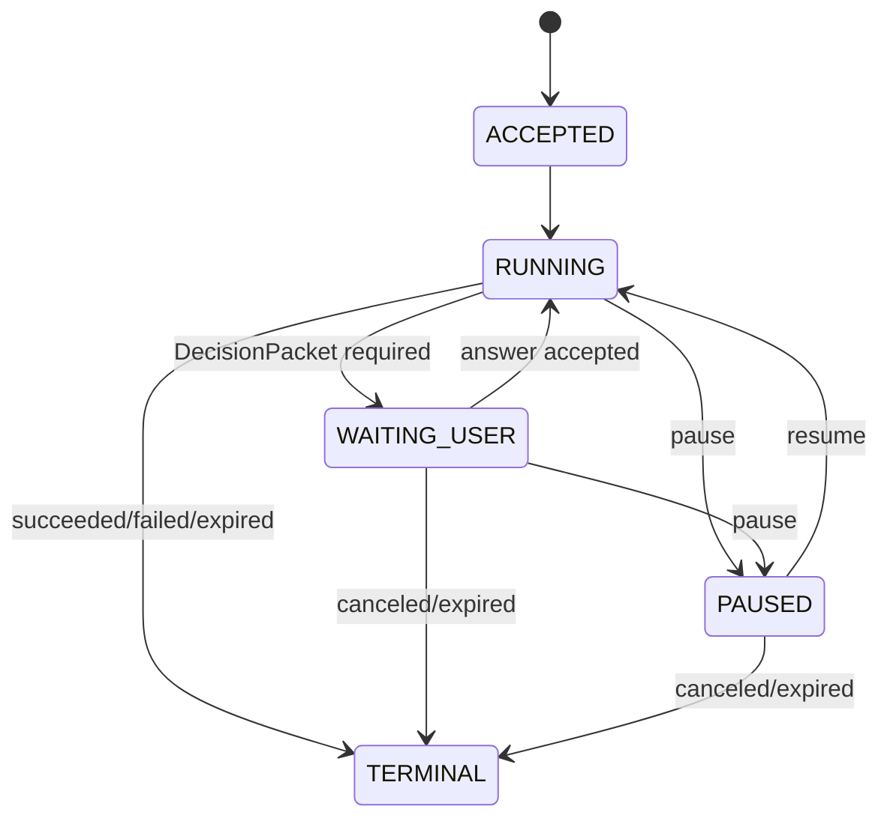

# Managed AutoML API 完整 API 设计

## 1. 设计目标

Managed AutoML API 的目标是为外部 Agent 平台提供一个独立、可恢复、可审计的 AutoML 执行后端。使用者只需上传数据并在必要时回答结构化问题；LLM 由外部 Agent 平台托管，本 API 不执行自由文本指令，也不保存 LLM prompt、思考过程或模型凭据。

正式 v1 API 需要满足：

- 单表 CSV/Parquet 数据上传和完整性校验。
- 二分类和回归任务的离线评估。
- scikit-learn、AutoGluon Tabular、TabPFN 标准后端发现和选择。
- Run 生命周期可恢复、可暂停、可取消、可观察。
- 中间过程、结果和 artifact 均可通过 API 返回。
- 不确定或高风险事项通过 `DecisionPacket` 中断，回答后继续。
- 外部 Agent 平台通过 manifest/context/actions 接入，不绕过 canonical API。
- 生产设计覆盖认证、授权、幂等、并发、分页、事件、Webhook、审批、删除和模型注册。

## 2. 设计原则

1. API-first：所有可见状态都通过 HTTP/OpenAPI 暴露，不要求接入方理解内部 worker。
2. LLM 外置：LLM、Prompt、规划和预算属于外部 Agent 平台。
3. 状态可恢复：Run、commands、outputs、events 和 artifact 引用必须可持久恢复。
4. 中断结构化：用户介入点必须是 schema 化 `DecisionPacket`，不能是任意对话文本。
5. 写入幂等：所有写操作使用 `Idempotency-Key`，网络重试不得产生重复副作用。
6. 并发显式：回答、暂停、恢复和审批使用明确 revision，不混用缓存 ETag。
7. 输出可信边界清晰：不返回原始数据行；数据派生文本标为不可信。
8. 生产门禁独立：`available=true`、训练成功和 `production_eligible=true` 不能相互推导。

## 3. 资源模型

| 资源 | 主 ID | 作用 |
| --- | --- | --- |
| Dataset | `dataset_id` | 数据集逻辑容器 |
| DatasetVersion | `dataset_version_id` | 不可变数据版本，只有 `READY` 后才能创建 Run |
| UploadSession | `upload_id` | 上传会话和分片 URL |
| Run | `run_id` | AutoML 工作流主资源 |
| RunSnapshot | `run_id` + `snapshot_seq` | Run 当前可见状态 |
| RunEvent | `event_id` + `seq` | 状态变化事件，用于 JSON 回放/SSE/Webhook |
| OutputResource | `output_id` | 阶段输出，如数据质量、任务规格、模型卡、运行报告 |
| DecisionPacket | `decision_packet_id` / `wait_set_id` | 结构化中断问题集合 |
| Command | `command_id` | answer/pause/resume/cancel 等异步命令 |
| Artifact | `artifact_id` | 大型产物元数据 |
| DownloadTicket | `ticket_id` | 短期下载凭证 |
| Experiment | `experiment_id` | trial/metric 聚合资源，生产 v1 目标 |
| Approval | `approval_id` | 高风险审批资源，当前 API 已实现 |
| ModelCandidate | `model_id` | 通过门禁的候选模型，生产 v1 目标 |
| WebhookEndpoint | `webhook_endpoint_id` | 事件订阅端点，当前 API 已实现 |
| WebhookDelivery | `delivery_id` | Webhook outbox 投递记录，当前 API 已实现 |
| DeletionJob | `deletion_id` | 删除 saga 跟踪资源，当前 API 已实现 |

## 4. Run 状态机

状态语义：

- `phase` 表示当前业务阶段，如 profile、plan、train、evaluate。
- `status` 表示控制状态，如 running、waiting user、paused、terminal。
- `outcome` 只在终态出现，如 succeeded、failed、canceled、expired。
- `run_revision` 只随控制语义变化推进。
- `snapshot_seq` 随所有可见事件推进。
- `retained_from_seq` 表示事件保留窗口起点。

## 5. API 分层

| 层级 | 代表路由 | 作用 |
| --- | --- | --- |
| 能力发现 | `/v1/agent/manifest` | 发现服务边界、后端、限制和 scope |
| 数据上传 | `/v1/datasets`、`/v1/dataset-versions/*` | 创建数据版本并校验字节 |
| Run 控制 | `/v1/runs`、`/v1/runs/{id}`、`:pause`、`:resume`、`:cancel` | 创建和控制工作流 |
| 事件观察 | `/v1/runs/{id}/events` | JSON 回放和 SSE |
| 输出读取 | `/v1/runs/{id}/outputs` | 读取中间和终态输出 |
| 中断恢复 | `/v1/runs/{id}/decision-packets`、`:answer` | 结构化人机协作 |
| 命令跟踪 | `/v1/commands/{id}` | 查询异步命令状态 |
| 结果读取 | `/v1/runs/{id}/result` | 读取终态结果 |
| 产物下载 | `/v1/artifacts/{id}`、`:download`、`/v1/artifact-downloads/{token}` | 元数据和短期下载 |
| Agent 接入 | `/v1/runs/{id}/agent-context`、`/agent-actions` | 外部 Agent 平台受限上下文和动作 |
| 生产扩展 | experiments、approvals、models、webhooks、deletions | 正式生产 v1 目标能力 |

## 6. 路由矩阵

| 方法 | 路由 | operationId | 当前状态 | 生产 v1 目标 |
| --- | --- | --- | --- | --- |
| `GET` | `/healthz` | 非 OpenAPI | 可用 | 可用 |
| `GET` | `/readyz` | 非 OpenAPI | 可用 | 可用 |
| `GET` | `/openapi.yaml` | 非 OpenAPI | 可用 | 可用 |
| `GET` | `/v1/agent/tool-openapi.yaml` | 非 OpenAPI | 可用 | 可用 |
| `GET` | `/v1/agent/manifest` | `getAgentInterfaceManifest` | 可用 | 可用 |
| `POST` | `/v1/datasets` | `createDatasetUpload` | 可用 | 可用 |
| `POST` | `/v1/dataset-versions/{id}/upload-parts:sign` | `signDatasetUploadParts` | 可用 | 可用 |
| `PUT` | `/v1/dataset-versions/{id}/upload-parts/{part}` | 非 OpenAPI | 可用 | 对象存储预签名或等价 data-plane |
| `POST` | `/v1/dataset-versions/{id}:finalize` | `finalizeDatasetUpload` | 可用 | 可用 |
| `GET` | `/v1/dataset-versions/{id}` | `getDatasetVersion` | 可用 | 可用 |
| `POST` | `/v1/runs` | `createRun` | 可用 | 可用 |
| `GET` | `/v1/runs` | `listRuns` | 可用 | 可用 |
| `GET` | `/v1/runs/{id}` | `getRun` | 可用 | 可用 |
| `GET` | `/v1/runs/{id}/agent-context` | `getAgentRunContext` | 可用，未完成生产 DLP | 可用且 DLP/opaque ID 完成 |
| `GET` | `/v1/runs/{id}/agent-actions` | `listAgentRunActions` | 可用 | 可用 |
| `GET` | `/v1/runs/{id}/stages` | `listRunStages` | 可用 | 可用 |
| `GET` | `/v1/runs/{id}/events` | `readRunEvents` | 可用 | 可用，扩大保留和 outbox |
| `GET` | `/v1/runs/{id}/outputs` | `listRunOutputs` | 可用 | 可用 |
| `GET` | `/v1/runs/{id}/outputs/{output_id}` | `getRunOutput` | 可用 | 可用 |
| `GET` | `/v1/runs/{id}/experiments` | `listRunExperiments` | 空页占位 | 返回 trial/metric 聚合 |
| `GET` | `/v1/runs/{id}/experiments/{experiment_id}` | `getRunExperiment` | `404` | 返回实验详情 |
| `GET` | `/v1/runs/{id}/decision-packets` | `listDecisionPackets` | 可用 | 可用 |
| `POST` | `/v1/runs/{id}/decision-packets/{wait_set_id}:answer` | `answerDecisionPacket` | 可用 | 可用，强化 actor policy |
| `GET` | `/v1/runs/{id}/approvals` | `listRunApprovals` | 可用 | 返回审批对象 |
| `POST` | `/v1/runs/{id}/approvals/{approval_id}:decide` | `decideApproval` | 可用 | 提交审批决定 |
| `POST` | `/v1/runs/{id}:pause` | `pauseRun` | 可用 | 可用 |
| `POST` | `/v1/runs/{id}:resume` | `resumeRun` | 可用 | 可用 |
| `POST` | `/v1/runs/{id}:cancel` | `cancelRun` | 可用 | 可用 |
| `GET` | `/v1/commands/{id}` | `getCommand` | 可用 | 可用 |
| `GET` | `/v1/runs/{id}/result` | `getRunResult` | 可用 | 可用 |
| `GET` | `/v1/artifacts/{id}` | `getArtifact` | 可用 | 可用 |
| `POST` | `/v1/artifacts/{id}:download` | `createArtifactDownloadTicket` | 可用 | 可用 |
| `GET` | `/v1/artifact-downloads/{token}` | 非 OpenAPI | 可用 | 可用 |
| `GET` | `/v1/models/{id}` | `getModelCandidate` | 可用，审批通过后有资源 | 返回已注册候选模型 |
| `POST/GET/DELETE` | `/v1/webhook-endpoints...` | 多个 Webhook operation | 可用，HTTP dispatcher 为独立 worker | 完整 Webhook 管理 |
| `DELETE` | `/v1/datasets/{id}` | `deleteDataset` | 可用 | 启动删除 saga |
| `GET` | `/v1/deletions/{id}` | `getDeletionJob` | 可用 | 查询删除任务 |

逐路由请求示例见 `docs/api-route-reference.md`。

## 7. 请求和响应约定

### 7.1 认证

- 所有 `/v1/*` control-plane 路由默认需要 Bearer。
- `healthz`、`readyz`、`openapi.yaml` 可作为部署探针和契约读取入口。
- 生产 scope 格式为 `automl:operation:<operationId>`。
- data-plane artifact download 使用短期 token 和 `If-Match`，不使用 API Bearer。

### 7.2 幂等

写操作必须带 `Idempotency-Key`：

- `POST /v1/datasets`
- `POST /v1/dataset-versions/{id}/upload-parts:sign`
- `POST /v1/dataset-versions/{id}:finalize`
- `POST /v1/runs`
- `POST /decision-packets/{wait_set_id}:answer`
- `POST /runs/{id}:pause`
- `POST /runs/{id}:resume`
- `POST /runs/{id}:cancel`
- `POST /artifacts/{id}:download`
- 生产目标中的 Webhook、approval、delete 写操作

同一 key + 同一请求体返回同一结果；同一 key + 不同请求体返回 `409 idempotency_key_reused`。

### 7.3 并发控制

| 操作 | Header | 绑定对象 |
| --- | --- | --- |
| 回答 DecisionPacket | `If-Match: "<wait_set_revision>"` | wait-set |
| 暂停 Run | `If-Match: "<run_revision>"` | Run 控制 revision |
| 恢复 Run | `If-Match: "<run_revision>"` | Run 控制 revision |
| 下载 artifact | `If-Match: "<artifact_etag>"` | artifact bytes |
| 读取缓存 | `If-None-Match: "<representation_etag>"` | HTTP 表示 |

不能用 Run HTTP ETag 代替 `run_revision` 或 `wait_set_revision`。

### 7.4 分页和游标

- 首次请求可带过滤参数和 `limit`。
- 后续请求只带 `cursor`，不能重复传过滤参数。
- `cursor` 绑定租户、父资源、过滤条件和 high watermark。
- 事件 cursor 过期返回 `410 cursor_expired`，客户端应读取最新 RunSnapshot 后从新水位恢复。

### 7.5 错误格式

错误统一使用 RFC 9457 风格 problem document，包含稳定 `code`、`title`、`detail` 和 `correlation_id`。
公共错误不得包含原始数据行、凭据、栈信息或 LLM prompt。

## 8. ML 任务语义

### 8.1 数据假设

当前 v1 tabular 范围：

- 单表 CSV/Parquet。
- 目标列由请求给出或通过 `DecisionPacket` 确认。
- 支持二分类和回归。
- 当前不支持多分类、时间序列、关系型多表、图像、文本、音频和在线推理。

### 8.2 Split 和泄漏控制

- API 统一执行数据解析、目标列验证、重复样本分组、泄漏检查和 sealed holdout。
- 后端只能在开发集内做选择；最终评估使用 sealed holdout。
- i.i.d. 假设不明确时必须生成 `DecisionPacket`。
- 时间字段、分组字段、预测时点之后才出现的字段应在生产 DLP/数据审查阶段拦截。

### 8.3 指标

二分类常用：

- `roc_auc`
- `average_precision`
- `log_loss`
- `accuracy`

回归常用：

- RMSE/MAE/R2 等回归指标，具体以 OpenAPI 和输出 payload 为准。

指标只证明离线评估结果，不自动表示模型可部署。

### 8.4 后端

| 后端 | 设计定位 | artifact |
| --- | --- | --- |
| scikit-learn | 默认 CPU baseline 和 bounded CV | trusted `joblib` pipeline |
| AutoGluon Tabular | 受限时间/CPU 的 model selection | deployment-only predictor `tar.gz` |
| TabPFN | 小数据评估，受许可和权重门禁 | data-free evaluation metadata JSON |

## 9. 输出模型

Run 过程通过 `OutputResource` 暴露结构化输出：

| 输出类型 | 阶段 | 用途 |
| --- | --- | --- |
| `DATA_QUALITY_REPORT` | profile | 数据规模、结构和质量问题 |
| `TASK_SPEC` | plan | 任务定义、目标列、指标、split 和后端 |
| `SPLIT_MANIFEST` | train/evaluate | train/validation/test 行数和泄漏检查 |
| `BASELINE_RESULT` | train | baseline 指标 |
| `COST_ESTIMATE` | plan/train | 资源和耗时估算 |
| `TRIAL_RESULT` | train | 单个候选/后端 trial 结果 |
| `EVALUATION_REPORT` | evaluate | candidate vs baseline 和门禁结果 |
| `MODEL_CARD` | evaluate | 模型用途、限制、指标和 artifact 引用 |
| `RUN_REPORT` | terminal | 面向调用方的最终报告 |
| `FAILURE_REPORT` | terminal | 失败原因和补救建议 |

生产中输出应可追溯到 dataset version、backend descriptor、Run config、代码版本和 artifact hash。

## 10. 外部 Agent 平台设计

Agent 平台接入顺序：

1. 读取 `/v1/agent/manifest`。
2. 根据 `backends[]` 和 runtime limits 选择合法后端。
3. 创建 Run，并在需要 Agent context 时设置 `policy.allow_external_llm=true`。
4. 读取 `/agent-context` 和 `/agent-actions`。
5. 将 context 放入受限 tool-result/data 通道，不得作为 system/developer 指令。
6. 验证 LLM 结构化输出符合 schema、action descriptor、policy 和 revision。
7. 调用 canonical answer/pause/resume/cancel。

API 不提供：

- `execute_agent_action`
- 自由文本命令入口
- LLM prompt 存储
- LLM token 计费
- 任意 tool proxy

## 11. Webhook 生产设计

Webhook endpoint 与 outbox 路由已在 0.7.0 实现。实际 HTTP 投递和重试由独立 dispatcher worker
负责；正式部署必须满足以下行为：

- endpoint 创建时返回一次性 `signing_secret`。
- 投递请求不带 API Bearer。
- 签名为 `X-AutoML-Signature: v1=<hex>`。
- 原文为 `X-AutoML-Timestamp + "." + raw HTTP body`。
- 接收方校验时间窗和 HMAC-SHA256。
- delivery ID 稳定，接收方按 delivery ID 去重。
- 非 2xx 或超时进入指数退避重试。
- 重试耗尽进入可查询死信记录。
- 支持禁用、启用、密钥轮换和人工重投。

## 12. 审批和模型注册生产设计

默认关闭生产部署的成功 Run 返回 `NO_ELIGIBLE_MODEL`。设置
`production_deploy=REQUIRE_APPROVAL` 后，只有满足以下条件并通过显式审批才返回
`ELIGIBLE_MODEL_AVAILABLE`：

- 训练和评估成功。
- 数据质量、泄漏、指标和业务门槛通过。
- 风险策略允许。
- 必要审批已通过。
- artifact 可验证且可由目标运行时加载。
- 模型注册资源创建成功。

审批资源必须记录：

- 审批类型、证据版本、过期时间。
- 审批主体、决定、理由和审计记录。
- 与 Run revision 和 output refs 的绑定关系。

## 13. 删除生产设计

删除是 saga，不是同步硬删：

1. `DELETE /v1/datasets/{dataset_id}` 创建 deletion job。
2. 停止或拒绝新的依赖 Run。
3. 标记数据版本、派生输出、artifact 和模型候选。
4. 删除对象存储字节。
5. 保留最小审计记录。
6. `GET /v1/deletions/{deletion_id}` 返回进度、失败项和可重试建议。

删除 API 必须避免跨租户枚举，失败时使用脱敏 problem document。

## 14. 版本和兼容策略

- HTTP API 使用语义化版本，当前为 0.7.0。
- v1 path 保持向后兼容；破坏性变更进入新版本 path 或新 major。
- Event type 使用 `.v1` 后缀，新增事件类型必须兼容旧客户端忽略策略。
- OutputResource 使用 `type` discriminator，新增输出类型不能改变旧类型字段含义。
- Agent tool OpenAPI 由 canonical OpenAPI 过滤生成，必须通过 `generate_agent_openapi.py --check`。
- SDK minor 版本可增加 helper，不应破坏已有方法签名。

## 15. 设计完成定义

API 设计视为完整需要满足：

- OpenAPI 覆盖所有 control-plane 路由、Schema、错误和 operationId。
- 隐藏 data-plane 路由在文档中明确说明。
- 所有写操作定义幂等和并发前置条件。
- 所有分页定义 cursor 语义和过期恢复方式。
- Run、DecisionPacket、Command、Output、Result、Artifact 状态关系明确。
- 外部 Agent 平台只通过受限上下文和 canonical action refs 接入。
- 生产目标能力虽可分阶段实现，但路由、资源、签名和错误语义已冻结。
- 测试覆盖 OpenAPI 一致性、SDK、端到端、认证、限额、后端和 release packaging。
