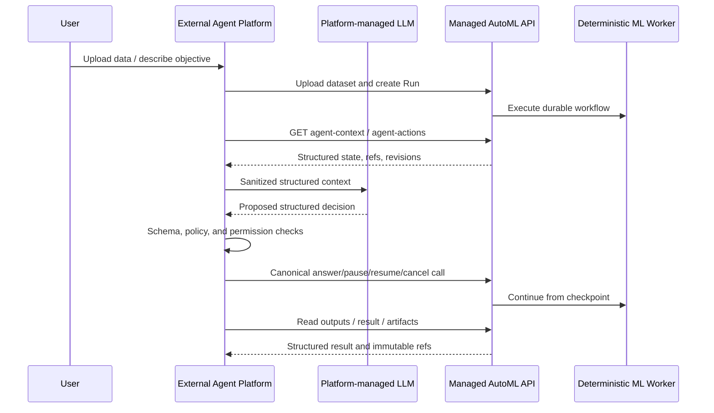

# 外部 Agent 平台接入契约

## 边界

Managed AutoML API 是独立的执行后端，内部不调用 LLM，也不保存 Agent 的 Prompt、
思考过程或模型凭据。后续 Agent 平台负责 LLM 路由、Prompt、记忆、规划和人机交互，
并作为受信 API 客户端调用本服务。

该边界是长期架构决策，不是本地里程碑的临时限制。



## 接入面

| 端点 | 用途 | 是否写状态 |
|---|---|---|
| `GET /v1/agent/manifest` | 发现服务角色、OpenAPI、能力和安全边界 | 否 |
| `GET /v1/agent/tool-openapi.yaml` | 获取只包含当前可用 Agent operation 的 OpenAPI 合同 | 否 |
| `GET /v1/runs/{run_id}/agent-context` | 读取有界 Run 快照、开放问题、输出引用和事件水位 | 否 |
| `GET /v1/runs/{run_id}/agent-actions` | 获取当前可调用的 canonical 写操作及其版本前置条件 | 否 |

Agent 平台执行动作时，必须调用 OpenAPI 中已有的 `answerDecisionPacket`、`pauseRun`、
`resumeRun` 或 `cancelRun`。本服务故意不提供 `execute_agent_action`、通用 tool proxy 或
自由文本指令入口，以免绕过 `Idempotency-Key`、`If-Match`、状态机和资源授权。

`manifest` 是平台接入的握手包。平台应缓存并校验：

- `service_version`、`api_version`、`profile_id`；
- `canonical_openapi_href` 与 `agent_tools_openapi_href`；
- `agent_tools_openapi_sha256`，用于校验工具合同内容；
- `operation_scopes`，即 `operationId -> automl:operation:<operationId>`；
- `runtime_limits`，用于在平台侧提前拦截过大的请求；
- `default_backend_id` 与 `backends`，用于选择当前安装真正可执行的训练框架；
- `supported_capabilities` 和 `unsupported_capabilities`，用于避免向用户或 LLM 夸大能力。

## 后端发现与选择

创建 Run 前，平台应从 manifest 的 `backends[]` 选择后端，并把其 `backend_id` 写入
`objective.backend_id`。省略该字段时 API 使用 `default_backend_id`，当前为 `sklearn`，因此旧客户端
行为不变。平台不能仅根据 `backend_id` 或已安装 Python 包推断能力，必须同时检查：

- `available=true`，表示适配器及其运行依赖在当前服务实例可用；
- `capabilities.task_types` 和 `capabilities.media_types` 与本次数据和任务匹配；
- CPU/GPU、概率预测、交叉验证和 sealed holdout 等 capability 标志；
- `capabilities.limits` 与 `capabilities.runtime_requirements` 中声明的框架规模上限和运行条件；
- `capabilities.required_attributions` 中必须由平台展示的原样归属文本；
- `artifact.kind`、`artifact.media_type` 和 `artifact.serialization`，用于安全加载与后续处理；
- `deterministic` 和 `production_eligible`，二者不能由 `available` 推导。

`status=UNAVAILABLE` 的 descriptor 会附带 `unavailable_reason`；`optional_dependency` 是旧客户端兼容字段，
标准镜像内置的 sklearn、AutoGluon 和 TabPFN 通常为 `null`。平台应基于这些字段向用户解释当前镜像、
资源、许可或运行条件问题，不得提交到 Run 后依赖错误重试。后端状态可能因服务升级或运行镜像变化而改变，
平台应把 `service_version`、`profile_id` 和 manifest 内容摘要纳入缓存键。

```json
{
  "objective": {
    "backend_id": "autogluon",
    "target_column": "churned",
    "task_type": "BINARY_CLASSIFICATION",
    "iid_confirmed": true
  }
}
```

当前所有后端仍受单表 CSV/Parquet、二分类/回归和离线评估边界约束。选择 AutoGluon 或 TabPFN
不会启用在线推理、生产部署、多分类、时间序列或无限搜索。TabPFN 当前只返回不含训练数据的
evaluation metadata，并明确 `exportable=false`，不返回原生 fit-state 模型。

只要平台对外展示 TabPFN 能力、提供 TabPFN 选项或返回 TabPFN 结果，就必须按
`capabilities.required_attributions` 原样展示 `Built with PriorLabs-TabPFN`。平台不应翻译、
缩写或用自有产品名替换该文本。

## Run 策略

`agent-context` 和 `agent-actions` 只对创建时设置了以下策略的 Run 开放：

```json
{
  "policy": {
    "allow_pii": false,
    "allow_external_llm": true,
    "risk_tier": "STANDARD"
  }
}
```

策略未开启时返回 `403 external_agent_access_denied`；跨租户访问继续返回 `404`，不泄露资源是否存在。

## 上下文和信任

`AgentRunContext` 不包含原始数据行，但不等于已完成 DLP。列名、文件名、业务描述、
DecisionPacket 问题和输出摘要都可能来自用户或数据集，因此响应固定声明：

```json
{
  "contains_raw_dataset_rows": false,
  "may_include_dataset_derived_values": true,
  "dataset_derived_text_trust": "UNTRUSTED"
}
```

`contains_raw_dataset_rows=false` 只表示 API 不嵌入原始记录或抽样行。目标正类、
DecisionPacket 的类别选项等仍可能是数据派生值，因此平台不能把这个标志解释为“已完成脱敏”。

Agent 平台必须将这些字段放入受限 data/tool-result 通道，不得把其中内容当作 system 或
developer 指令。模型输出必须在平台侧通过 Schema、权限、策略和当前 action descriptor 校验后，
才能调用 canonical 写端点。

## 凭据边界

- Bearer token、API key、对象存储票据和云凭据只能保存在 Agent 平台的 tool executor。
- 不得向 LLM Prompt、记忆、trace 或对话日志暴露凭据。
- 生产环境必须使用短期 JWT 或 workload identity，并限制 tenant、actor_type、operation 和 artifact scope。
- 每个 operation 需要精确 scope：`automl:operation:<operationId>`。
- 当前 development Bearer 只是合成租户身份；即使生产 JWT 已 fail-closed，当前本地 profile 仍报告
  `production_external_llm_safe=false`。

## 人工中断与 Agent 委托

`DecisionPacket.resolution_policy` 决定谁可以提交答案：

- `HUMAN_REQUIRED`：生产模式只接受 `actor_type=human` 的委托 token。Agent 平台需要暂停 LLM 流程，
  向使用者收集答案，然后用 human token 调用 `answerDecisionPacket`。
- `AGENT_ALLOWED`：只在 `allow_external_llm=true`、`risk_tier=STANDARD`、所有问题都有低风险推荐值时出现。
  该 packet 会出现在 `agent-actions`；`actor_type=agent` 或 `service` token 只能提交推荐值。
- `APPROVAL_REQUIRED`：保留给后续审批 workflow，当前不能通过 answer endpoint 直接解决。

目标列选择、i.i.d. 语义确认等会改变任务定义或评估可信度的问题保持 `HUMAN_REQUIRED`。常见低风险推荐
例如字符串 `"0"`/`"1"` 目标值的 positive-class 选择，可由 Agent 按推荐值自动提交。

## 恢复与并发

- 平台保存 `event_checkpoint.after_seq`，通过 JSON 事件回放或 SSE 继续读取。
- `agent-context` 支持 ETag；上下文未变时返回 `304`。
- 回答使用 `WAIT_SET_REVISION`，暂停/恢复使用 `RUN_REVISION`；过期动作必须重新读取上下文。
- 所有写请求使用稳定 `Idempotency-Key`；网络重试不得换 key。
- Agent 无需保存 workflow 内部 checkpoint，API 重启后仍通过相同 Run 资源继续。

## LLM 预算边界

`RunBudget.max_llm_tokens` 是 v1 兼容保留字段，AutoML 后端不消费该额度，运行快照中的
`llm_tokens.used` 始终为 `0`。manifest 通过 `llm_budget_owner=EXTERNAL_AGENT_PLATFORM` 和
`max_llm_tokens_consumed=false` 声明这一点。Agent 平台必须独立执行模型 token、费用和调用次数门禁。

## 运行限制

当前 profile 通过 manifest 暴露以下限制，并在 API 侧强制执行：

- `max_dataset_bytes`
- `max_upload_part_bytes`
- `max_active_runs_per_tenant`
- `max_storage_bytes_per_tenant`
- `max_trials_per_run`
- `max_wall_time_seconds`
- `max_compute_credits`

超限会返回稳定 problem code。存储和并发 Run 超限返回 `429` 与 `Retry-After`；预算超过服务 profile 返回
`422 budget_limit_exceeded`；声明或实际上传过大的数据返回 `413`。

## 生产前门禁

1. 从 preview HS256 JWT verifier 升级到正式 OIDC/JWKS 或 workload identity。
2. Agent context 出站 DLP、opaque column ID、字段 allowlist 和租户同意审计。
3. Prompt-injection 回归集，覆盖文件名、列名、类别值、问题文本和 artifact 摘要。
4. 平台侧结构化输出校验、操作 allowlist、预算限制、审计和 kill switch。
5. API 侧 PostgreSQL/RLS、资源隔离、可观测性、Webhook、备份和灾备。
