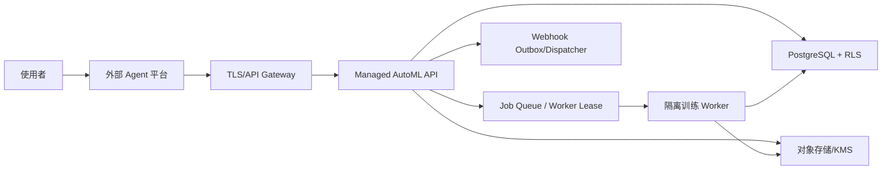

# Managed AutoML API 生产级交付方案

## 1. 文档信息

| 项目 | 内容 |
| --- | --- |
| 文档目的 | 定义 Managed AutoML API 从本地可用版本走向生产交付所需的交付物、配置、安全门禁、运维流程和验收标准 |
| 目标读者 | 平台负责人、后端工程、Agent 平台集成团队、运维/SRE、安全与合规评审人员 |
| 当前代码版本 | 0.7.0 |
| 当前实现 profile | `local-durable-tabular-v1` |
| 生产交付判断 | API 设计和单节点交付包具备合作方集成条件；0.7.0 formal profile 固定未就绪，不能用于正式生产上线 |

## 2. 交付结论

当前仓库已经具备以下可交付能力：

- API-first 的 AutoML 后端、canonical control-plane OpenAPI 和封装 data-plane 传输的 Python SDK。
- 外部 Agent 平台接入面：manifest、tool OpenAPI、Agent context 和 canonical action refs。
- 数据上传、Run 创建、事件观察、结构化中断、回答后恢复、输出、结果和 artifact 下载闭环。
- 标准 tabular 后端：scikit-learn、AutoGluon Tabular、TabPFN。TabPFN 的真实权重启用受许可、token 或 checkpoint 条件约束。
- 单机 Docker/Compose 定义、formal profile fail-closed 配置、非 root 容器、只读文件系统和资源限制。
- 测试报告、路由手册、后端说明、外部 Agent 集成契约和 release bundle 校验工具。

Dockerfile 的 formal target 声明以下依赖与控制面预览能力。当前最新工作树的全量 Docker 构建和
容器 smoke 仍须按第 10 节重新验证，不能引用旧镜像作为本轮证据：

- OIDC/JWKS verifier、PostgreSQL client、S3/KMS client、Webhook HTTP client 等生产依赖。
- `AUTOML_DEPLOYMENT_PROFILE=production` 下的 `/readyz` hard fail-closed；0.7.0 中即使环境变量
  齐全也固定返回 `503 production_preflight_failed`。
- PostgreSQL/RLS bootstrap SQL：`deploy/postgres/001_rls_schema.sql`。
- Webhook endpoint、outbox delivery 查询、重投、禁用/启用和密钥轮换 API。
- 生产部署审批 workflow，以及审批通过后的 `ModelCandidate` 注册和结果 manifest。
- local profile 中会撤销访问并物理删除本地数据集/artifact 字节的 deletion job API。

这些依赖尚未连接到实际请求路径。当前仓库仍需实现并验收：

- 多副本高可用、分布式 worker、PostgreSQL/RLS 和对象存储隔离。
- 出站 DLP 的 PII 回归集、opaque column ID 和租户同意审计。
- Webhook HTTP dispatcher 的真实投递、重试、死信和告警。
- AutoGluon/TabPFN 的容器级硬隔离、硬超时和资源压力测试。

因此，0.7.0 可以作为合作方 Agent 平台的嵌入式集成版本和非生产试运行版本；formal profile
在本版本中恒为未就绪。完成第 11 节门禁后仍需发布接入真实 runtime adapter 的新版本，不能仅靠
修改环境变量解除该门禁。

## 3. 交付物清单

| 交付物 | 路径 | 用途 |
| --- | --- | --- |
| Canonical OpenAPI | `openapi/automl-api.yaml` | 完整 HTTP 契约、Schema 和 operationId |
| Agent tool OpenAPI | `openapi/automl-agent-tools.yaml` | 外部 Agent 平台工具合同 |
| API 路由手册 | `docs/api-route-reference.md` | 每个路由的用途和示例 |
| API 使用流程 | `docs/api-usage.md` | 上传、运行、中断、恢复、结果、artifact 完整调用流程 |
| 完整 API 设计 | `docs/complete-api-design.md` | 正式 v1 资源、状态机、路由矩阵和兼容策略 |
| 外部 Agent 接入契约 | `docs/external-agent-integration.md` | API 与 Agent 平台的职责边界 |
| 后端框架说明 | `docs/framework-backends.md` | scikit-learn、AutoGluon、TabPFN 的能力和限制 |
| 测试报告 | `docs/test-report-0.7.0.md` | 逐项验证证据和限制 |
| 生产交付方案 | `docs/production-delivery.md` | 本文档 |
| 生产环境变量模板 | `.env.production.example` | Compose/部署系统的生产配置样例 |
| Dockerfile/Compose | `Dockerfile`、`compose.yaml` | 本地和单节点部署 |
| Python SDK | `packages/python_sdk` | 外部系统同步客户端 |
| CI workflow | `.github/workflows/ci.yml` | lint、format、OpenAPI、pytest 验证 |

## 4. 目标生产架构



生产目标职责：

- API Gateway 负责 TLS、WAF、请求大小限制、租户域名策略和外部身份入口。
- Managed AutoML API 负责公共资源状态、幂等、授权、状态机和 API 契约。
- PostgreSQL/RLS 负责租户隔离、事务投影、事件水位和 idempotency 记录。
- 对象存储/KMS 负责数据集、artifact、模型包和分片上传下载。
- Worker 负责训练、评估、输出和 artifact 生成，并通过进程/容器边界隔离框架运行。
- Webhook dispatcher 负责异步事件投递、重试、死信和人工重投。
- 外部 Agent 平台负责 LLM、Prompt、工具调用策略、凭据保管和人机交互。

## 5. 部署模式

### 5.1 当前可交付模式：单节点受控部署

适用场景：

- 合作方集成联调。
- 内网非生产试运行。
- 小规模 tabular 数据评估。
- API 契约、SDK、Agent 平台适配验证。

限制：

- SQLite 和本地对象目录不能作为多副本生产状态层。
- 容器内 AutoGluon/TabPFN 仍属于受信代码执行边界，不是强沙箱。
- 当前 manifest 固定报告 `production_external_llm_safe=false`。
- 默认 Run 返回 `NO_ELIGIBLE_MODEL`；只有显式设置 `REQUIRE_APPROVAL` 并完成审批才注册
  `ModelCandidate`，且 API 仍不自动部署在线推理服务。

启动建议：

```bash
cp .env.example .env
openssl rand -hex 32
docker compose up -d --build
curl -sS http://127.0.0.1:${AUTOML_BIND_PORT:-8000}/readyz
```

这会使用默认 `partner-preview` target。`.env.production.example` 只用于 formal profile 配置审查；
0.7.0 将该 profile 的 `/readyz` 无条件保持为 `503`，不能用它启动一个被误认为生产就绪的服务。

### 5.2 目标生产模式：多组件部署

上线生产前应将当前 local profile 替换或扩展为：

- PostgreSQL 元数据和事件库，所有租户资源使用 RLS 或等价隔离策略。
- 对象存储分片上传、短期下载票据和 KMS 加密。
- 独立 worker 池，支持 lease、心跳、重试、硬超时和资源配额。
- 正式身份系统，支持 OIDC/JWKS 或 workload identity。
- 集中日志、指标、trace、审计和告警。
- Webhook outbox 和 dispatcher。

## 6. 生产配置

目标生产实现必须设置以下配置。它们不会解除 0.7.0 formal profile 的固定 `503`：

| 配置 | 要求 |
| --- | --- |
| `AUTOML_AUTH_MODE` | 必须为 `production` |
| `AUTOML_JWT_ISSUER` | 必须等于身份提供方 issuer |
| `AUTOML_JWT_AUDIENCE` | 必须与调用方 token audience 一致 |
| `AUTOML_JWKS_URL` / `AUTOML_JWKS_JSON` | 正式生产二选一，并验证 issuer、audience、kid 和轮换 |
| `AUTOML_CURSOR_SECRET` | 独立随机密钥，不得与 JWT 或 ticket 密钥复用 |
| `AUTOML_TICKET_SECRET` | 独立随机密钥，用于 artifact download ticket |
| `AUTOML_MAX_*` | 按租户和硬件容量设置限额 |
| `AUTOML_TABPFN_*` | 只有完成许可和权重来源审批后才能启用 |

密钥生成示例：

```bash
openssl rand -hex 32
```

生产检查：

```bash
docker compose config
docker compose up -d
curl -fsS http://127.0.0.1:${AUTOML_BIND_PORT:-8000}/readyz
```

在 0.7.0 中，最后一步无论配置是否齐全都预期失败并返回
`503 production_preflight_failed`。只有实际 PostgreSQL/RLS、S3/KMS、DLP、隔离 worker 和
dispatcher 已接入请求路径并完成验收后的新代码版本，才允许修改该门禁。

## 7. 安全要求

### 7.1 身份与授权

- 每个公共 operation 使用精确 scope：`automl:operation:<operationId>`。
- 生产 token 必须包含租户、主体、actor_type 和 scopes。
- Agent 平台 service token 只能保存在 tool executor，不得进入 LLM prompt、trace 或记忆。
- `HUMAN_REQUIRED` 的 `DecisionPacket` 在生产环境必须由 human token 回答。
- `AGENT_ALLOWED` 只允许提交 packet 推荐值，不能自由改写高风险答案。

### 7.2 数据与 DLP

- API 不应向公共输出返回原始数据行。
- 列名、文件名、类别值、问题文本和输出摘要仍可能包含数据派生内容，必须标为不可信。
- Agent context 出站前必须增加字段 allowlist、opaque column ID、敏感词/PII 检测和租户同意审计。
- artifact 只能通过短期 ticket 下载，并校验 ETag、Content-Length、SHA-256。

### 7.3 训练运行隔离

- scikit-learn 和 AutoGluon artifact 使用 pickle/joblib 类格式，只能从可信 artifact store 加载。
- AutoGluon 和 TabPFN 生产 worker 应使用独立进程或容器执行，设置 CPU、内存、文件系统和 wall-time 上限。
- TabPFN 真实权重必须经过许可、来源、用途和商业范围审批；token 不得写入日志、Run 记录或 artifact。

## 8. 可观测性和审计

生产部署至少需要以下指标：

| 指标 | 目的 |
| --- | --- |
| API 请求量、延迟、错误率 | 判断接口健康和容量 |
| Run 创建数、终态分布、平均耗时 | 判断 AutoML 工作负载 |
| `WAITING_USER` 停留时间 | 判断人机中断体验 |
| 事件积压和 retained window | 判断事件回放风险 |
| Worker lease、重试、失败原因 | 判断执行层稳定性 |
| artifact 下载 ticket 创建和失败 | 判断产物交付可靠性 |
| 后端 availability 变化 | 判断 AutoGluon/TabPFN 运行环境 |

审计日志至少记录：

- tenant、subject、actor_type、operationId、resource_id、correlation_id。
- 写请求的幂等键、revision 前置条件和结果状态。
- 安全拒绝原因码、scope 缺失、跨租户隐藏访问。
- Agent context 读取和 DecisionPacket 回答。
- artifact ticket 签发和下载范围。

不得记录：

- Bearer/JWT、ticket token、对象存储凭据。
- 原始数据行、敏感样本值、LLM prompt、模型思考过程。

## 9. 备份和恢复

当前 local profile 的备份方式只能用于非生产：

- 停止服务后备份 `AUTOML_STATE_DIR`。
- 恢复时保持相同版本、同一 ticket/cursor secret 和对象目录。

生产目标：

- PostgreSQL point-in-time recovery。
- 对象存储版本化和生命周期策略。
- KMS 密钥轮换和灾备区域策略。
- 定期恢复演练，验证 Run、outputs、events、artifacts 和 idempotency 记录一致。

## 10. 发布流程

建议发布步骤：

1. 更新版本、CHANGELOG、OpenAPI 和 SDK。
2. 执行本地验证：

   ```bash
   ruff check .
   ruff format --check .
   python scripts/generate_agent_openapi.py --check
   pytest -q
   ```

3. 构建 wheels 和 Docker image。
4. 生成 release bundle：

   ```bash
   python scripts/package_release.py --docker-image managed-automl-api:0.7.0
   ```

5. 校验 `SHA256SUMS`。
6. 在隔离环境执行 smoke：
   - `/healthz`
   - partner-preview `/readyz` 返回 `200`；formal profile `/readyz` 返回预期的 `503`
   - `/v1/agent/manifest`
   - CSV 上传到 sklearn Run 终态
   - artifact ticket 下载校验
7. 发布 Git tag 和 release notes。

## 11. 生产上线门禁

| 编号 | 门禁 | 当前状态 | 验收方式 |
| --- | --- | --- | --- |
| G-001 | OIDC/JWKS 或 workload identity | verifier 已接入；真实 IdP 未验收 | 使用真实 IdP 验证 issuer/audience/kid/key rotation |
| G-002 | PostgreSQL/RLS | 仅客户端依赖和 bootstrap SQL，运行时仍为 SQLite | 跨租户读取、写入和分页测试全部返回预期 |
| G-003 | 对象存储/KMS | 仅 boto3 依赖，运行时仍为本地文件 | 上传、finalize、download ticket、Range、hash 验证通过 |
| G-004 | Worker 隔离与硬超时 | 未完成，运行时仍为进程内 worker | AutoGluon/TabPFN 超时、内存、CPU 和取消测试通过 |
| G-005 | Agent context DLP | 未完成，配置字符串不等于运行时 DLP | prompt injection 和 PII 回归集通过 |
| G-006 | Webhook dispatcher | durable outbox/redelivery API 可用；HTTP dispatcher 未实现 | HMAC、重试、死信、重投、禁用/启用测试通过 |
| G-007 | 审批 workflow | local 控制面可用；生产要求 human actor，完整审计待接入 | 状态转换、过期、身份和审计通过 |
| G-008 | 删除 saga | local 字节删除和访问撤销可用；外部存储 worker 未实现 | 数据集、派生输出、artifact 和审计保留策略通过 |
| G-009 | 模型注册和部署门禁 | local `ModelCandidate` 可用；真实质量门禁和部署未实现 | 合格结果只在质量/审批通过后出现 |
| G-010 | 可观测性/审计/告警 | 未完成 | SLO dashboard、告警和审计查询可用 |
| G-011 | 备份恢复 | 未完成 | 完整恢复演练通过 |
| G-012 | 合规与许可证 | 未完成 | AutoGluon/TabPFN/模型权重/数据用途审查完成 |

## 12. 交付验收标准

非生产集成验收：

- 接入方可通过 OpenAPI 或 Python SDK 完成一次 CSV/Parquet 上传、Run、DecisionPacket、result 和 artifact 下载。
- Agent 平台只通过 manifest/context/actions 和 canonical operation 调用 API。
- scikit-learn 和 AutoGluon 可用；TabPFN readiness 按许可/权重条件如实报告。
- `pytest -q`、`ruff check .`、`ruff format --check .` 和 OpenAPI 生成检查通过。
- release bundle 中包含 wheels、OpenAPI、Docker/Compose、生产交付文档、API 设计文档和校验文件。

生产上线验收：

- 第 11 节所有门禁为“完成”。
- 生产环境 manifest 可将 `production_external_llm_safe` 置为真实状态；在未完成 DLP 前不得置为 true。
- 至少完成一次灾备恢复演练和一次 Agent 平台 prompt-injection 回归。
- 至少完成一次含真实后端资源限制的压力测试。

## 13. 责任边界

| 事项 | Managed AutoML API | 外部 Agent 平台 |
| --- | --- | --- |
| 数据上传、Run、输出、artifact | 负责 | 调用 |
| LLM 调用、Prompt、模型选择策略 | 不负责 | 负责 |
| API 凭据保管 | 只校验 | 负责保存和注入 tool executor |
| 人工问题展示 | 生成结构化问题 | 负责用户交互 |
| Agent 自动回答 | 校验 action/revision/policy | 生成并验证结构化答案 |
| LLM token/费用预算 | 不消费 | 负责 |
| 生产 DLP | 提供边界字段 | 负责集成并共同验收 |
| 模型部署 | 后续门禁 | 后续平台流程 |
