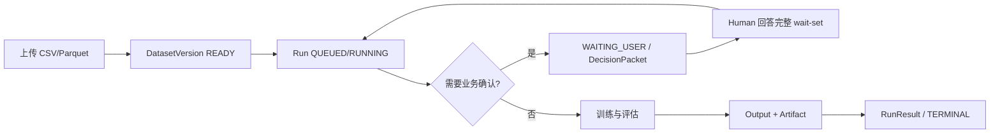

# Managed AutoML API 使用手册

## 1. 服务定位

Managed AutoML API 是独立的 AutoML 执行后端。使用者上传单表 CSV/Parquet，并在任务语义无法安全
推断时回答结构化问题；服务负责持久化、分析、训练、评估、事件、结果和 artifact。外部 Agent 平台
可以负责 LLM 编排，但不能绕过 API 的 canonical operation、权限、revision 和策略门禁。

## 2. 角色与职责

| 角色 | 主要职责 |
| --- | --- |
| 最终使用者 | 提供合规数据，确认目标列、i.i.d. 假设、正类和业务语义 |
| Agent 平台 | 保管凭据，执行 DLP，调用 API，展示过程，暂停并收集人工答案 |
| API 服务 | 管理 Dataset、Run、DecisionPacket、Output、Result、Artifact 和审计 |
| 部署运维方 | 管理 HTTPS/JWT、容量、备份、TabPFN 许可/权重和故障恢复 |

## 3. 核心资源和生命周期

客户端必须保存 `dataset_version_id`、`run_id`、`snapshot_seq`、`run_revision`、
`wait_set_revision`、`output_id` 和 `artifact_id`。不要依赖展示文本解析状态。

## 4. 使用前检查

1. 调用 `/healthz` 判断入口是否存活。
2. 使用 Bearer 调用 `/v1/agent/manifest`，核对 API/SDK 版本、限制和后端 readiness。
3. 只有 `backends[].available=true` 且支持目标任务和媒体类型时才能选择该后端。
4. `available=true` 不等于 `production_eligible=true`，训练成功也不等于已经上线推理。
5. 生产 token 必须绑定 tenant、subject、actor type、audience、issuer 和精确 operation scope。

## 5. 数据上传

当前接受 CSV 和 Parquet。上传前应完成：

- 确认一行代表一个观测对象，且目标值与特征位于同一张表。
- 删除不应参与训练的密钥、密码、自由文本隐私和直接身份字段，或按策略哈希化。
- 确认文件大小不超过 manifest 的 `max_dataset_bytes` 和 `max_upload_part_bytes`。
- 在 Agent 平台执行入站 DLP；`allow_pii=false` 是策略声明，不是自动扫描结果。

推荐调用 Python SDK 的 `upload_dataset_file()`。原始 HTTP 客户端必须按顺序完成：创建 upload
session、按服务返回 URL 和 headers 上传、保存 ETag、计算本地 SHA-256、finalize。上传 URL 不得自行
拼接。

## 6. 创建任务

`objective` 的关键字段：

| 字段 | 说明 |
| --- | --- |
| `backend_id` | `sklearn`、`autogluon` 或 `tabpfn`；省略时使用 manifest 默认值 |
| `target_column` | 预测目标；不确定时传 `null`，由 DecisionPacket 请求人工确认 |
| `task_type` | 当前支持 `BINARY_CLASSIFICATION`、`REGRESSION` |
| `positive_class` | 二分类正类；不确定时省略或传 `null` |
| `iid_confirmed` | 是否确认各行可视为独立同分布；不确定时传 `null` |
| `primary_metric` | 二分类通常用 `roc_auc`，回归通常用 `rmse` |
| `business_context` | 可选业务说明，可能进入 Agent context，必须先完成 DLP |

标准后端：

| 后端 | 适用场景 | 产物 |
| --- | --- | --- |
| sklearn | CPU baseline、快速和可重复评估 | 可信 store 内的 joblib pipeline |
| AutoGluon | 受控时间内的 bounded model selection | predictor `tar.gz` |
| TabPFN | 获得许可权重的小样本 tabular 评估 | 不含训练数据的 evaluation metadata |

每个 Run 还必须声明 `autonomy`、`policy` 和 `budget`。生产 Agent 平台不能通过增大客户端预算绕过
服务端 profile 限制。

### 6.1 绑定阶段 callback

Callback 必须先通过 `POST /v1/webhook-endpoints` 注册。创建响应中的 `signing_secret`
只返回一次，由 Agent 平台的 secret manager 保管，不得进入 LLM Prompt。然后在创建 Run 时
传入 `callback_uri`、`webhook_endpoint_ids` 之一或两者。URI 必须完全匹配同租户 ACTIVE
endpoint；两者都省略则本 Run 不产生 delivery。

服务在 `INGEST -> PROFILE -> PLAN -> TRAIN -> EVALUATE -> PACKAGE` 每个真实持久化边界后投递
`run.stage_completed.v1`。接收端必须在解析 JSON 前使用 raw body 验证 HMAC，检查 300 秒
时间窗，并按 delivery ID 持久化去重。可运行接收端见
[`examples/python/webhook_receiver.py`](../examples/python/webhook_receiver.py)。
每个阶段通知还包含 `callback.states`、`callback.next_stage`、`callback.next_stage_name` 和
`callback.reason`，详见[阶段 Callback 契约](stage-callback-contract.md)。`callback_url` 是弃用别名。

## 7. 观察过程

有三种互补方式：

- `GET /v1/runs/{run_id}`：读取权威快照和当前状态。
- `GET /v1/runs/{run_id}/events`：JSON 补拉或 SSE 连续订阅。
- `GET /v1/runs/{run_id}/outputs`：读取数据质量、任务定义、候选结果、评估和报告。
- Webhook callback：接收离线阶段通知；失败重试不改变 Run 结果，不是唯一事实源。

平台应持久化最后成功处理的 `seq`。SSE 断线后使用 `Last-Event-ID` 或 `after_seq` 续读，并按
`event_id` 去重。不能因为网络中断就创建新 Run。

## 8. 处理人工中断

Run 进入 `WAITING_USER` 时：

1. 查询 `status=OPEN` 的 DecisionPacket。
2. 展示 `reason`、每个 question、可选项、风险说明和后果。
3. 一次性收集并提交 wait-set 中所有必答问题。
4. 使用 `If-Match: "<wait_set_revision>"` 和稳定 `Idempotency-Key`。
5. 等待 Command 成功；workflow 会自动从 checkpoint 继续，不需要额外调用 resume。

生产环境的 `HUMAN_REQUIRED` 只能由同租户 `actor_type=human` token 回答。Agent token 不得冒充人工。
如果返回 `412 stale_revision`，重新读取开放 packet，不要盲目重试旧答案。

## 9. 读取结果

终态包括 `SUCCEEDED`、`FAILED`、`CANCELED` 和 `EXPIRED`。客户端以 `RunResult.outcome` 和
`model_disposition` 判断结果：

- `NO_ELIGIBLE_MODEL`：离线评估已完成，但没有通过生产审批的模型；默认流程通常返回此状态。
- `ELIGIBLE_MODEL_AVAILABLE`：存在经过显式审批的 ModelCandidate，不代表已经部署推理服务。
- `INCOMPLETE`：任务失败、取消或过期；读取 `reason.code`、`retriable` 和 `remediation`。

失败事件与结果中的 `retriable` 决定平台是否可以建议重试。输入或任务语义错误通常需要修正请求，
而不是自动无限重试。

训练成功后，`EVALUATION_REPORT.payload.visualizations[]` 列出每张评估图的生成、跳过或失败状态。
成功的 PNG 同时出现在 `EVALUATION_REPORT.artifact_refs[]` 和 `RunResult.visualization_refs[]`。
二分类包含指标表、混淆矩阵、ROC、PR，并按数据条件生成校准图；回归包含指标表、
观测/预测、残差和残差分布。为避免单行泄露，无法形成至少两个样本聚合单元的回归 hexbin
会标记为 `SKIPPED`，不会生成空图或单点图。

## 10. 下载 artifact

1. 从 Output 的 `artifact_refs[]` 获取 `artifact_id`。
2. 调用 `POST /v1/artifacts/{artifact_id}:download` 创建短期票据。
3. 使用票据 `url` 和 `required_headers` 下载，不携带 API Bearer 到跨域对象存储。
4. 校验 ETag、Content-Length 和 SHA-256；中断时按 `Range` 续传。

优先使用 SDK `download_artifact_file()`。sklearn/AutoGluon 序列化产物只能从可信 artifact store 加载，
不要加载用户任意上传的 pickle/joblib/tar。

## 11. Agent 平台接入

平台启动时读取 manifest 和 Agent 工具 OpenAPI，把 operation 映射为平台工具。每次调用前：

- Bearer 只存在 tool executor，不进入 Prompt、记忆或 trace。
- `agent-context` 中列名、文件名、类别值和问题文本按不可信数据处理。
- API 结果进入 LLM 前执行字段 allowlist、opaque ID、PII 检测和长度限制。
- LLM 输出必须按 JSON Schema 解析，并重新校验 tenant、scope、资源 ID、策略和 `If-Match`。
- 不提供通用 `execute_agent_action`；只能调用 OpenAPI 声明的 canonical operation。

完整安全边界见[外部 Agent 平台接入契约](external-agent-integration.md)。

## 12. 常见错误处理

| HTTP | 常见原因 | 处理方式 |
| --- | --- | --- |
| 400/422 | Schema、枚举、metric 或任务语义错误 | 修正请求，不自动重试 |
| 401 | token 缺失、过期、issuer/audience 错误 | 刷新正确凭据 |
| 403 | scope、actor 或 policy 不允许 | 检查 operation scope 和委托角色 |
| 404 | 资源不存在或跨租户隐藏 | 检查 tenant 和资源 ID，不枚举资源 |
| 409 | 状态冲突或幂等键复用不同请求 | 重新读取权威状态 |
| 412 | revision 已过期 | 重新读取 packet/run 后再提交 |
| 413 | 数据或请求体过大 | 压缩/拆分业务数据或调整已批准限额 |
| 429 | 速率、租户存储或活跃 Run 超限 | 遵循 `Retry-After`，等待现有任务结束 |
| 500 | 服务内部错误 | 保存 correlation ID，联系运维，不提交敏感数据 |
| 503 | 并发门禁、依赖或生产预检失败 | 查询健康状态和运维告警 |

## 13. 结束与运维

- 平台应展示 Run ID、终态、主要指标、后端、artifact 和必要 attribution。
- 使用者不再需要数据时调用删除 API，并跟踪 DeletionJob；生产存储需要独立删除 worker。
- 运维方定期验证备份和恢复，不把同盘备份视为异地灾备。
- API 不提供在线推理 endpoint。模型上线、漂移监控和生产回滚属于外部模型服务流程。

完整代码案例见 [`examples/`](../examples/README.md)，逐路由说明见
[API 路由使用手册](api-route-reference.md)。
